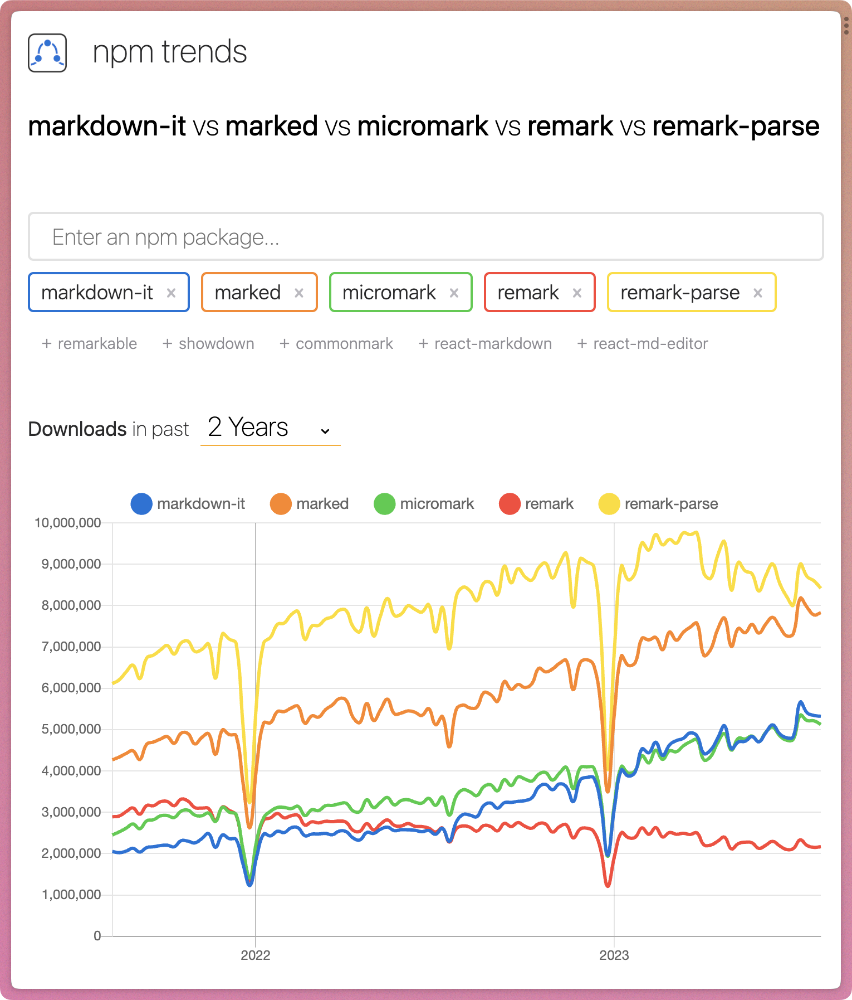

## Context

I've struggled finding a markdown processor for non-Astro controlled transformations.

My needs:

- Take my markdown files
- CommonMark/GFM cmopatabile
- Strip out any non-standard formatting (e.g. `expressive-code/frames`)
- Render simplest possible markdown
- Include syntax language for code blocks (for possible tooltip helpers)
- Have means of processing custom syntax (directives)
- Allow some form of customization

Ultimately, I think that will be `remark-parse`.
But I wanted to start with something that that was most of what I need out of the box.

### Options

[markdown-it](https://github.com/markdown-it/markdown-it) is extremely simple. I used it in eleventy. And it's recommended in the [Astro: Add an RSS feed doc](https://github.com/markdown-it/markdown-it).

Naturally I tried to pull double duty with it. Then learned that it just isn't rendering images _at all_ (including in my RSS feed. problem for another day).

[micromark][] has a lot of the features in my checklist, and first-class extensions for featurse that I use. it's also 100% CommanMark/GFM compatable.

My understanding is that it doesn't use an AST. So any `remark` knowledge kinda goes out the window.
So our final destination will likely be `remark-parse`.

[marked][https://github.com/markedjs/marked] is massively popular but lists CommonMark and GFM support as "in progress".

## Decision

Use [micromark][] for alternative markdown processing.

## Consequences

- I'll need to come up with a solution for loading pngs
  - I still can't figure out how to change Astro's experimental from `webp` to `png` but, even if i could, I don't think I'd have access to the digest image hashes.
  - But I can grab the images from githubcontent (for my immediate purposes)
- In the short term, I will have 3 different markdown processors.
- Will eventually end up moving to `remark-parse` and doing it all again.

[micromark]: https://github.com/micromark/micromark
