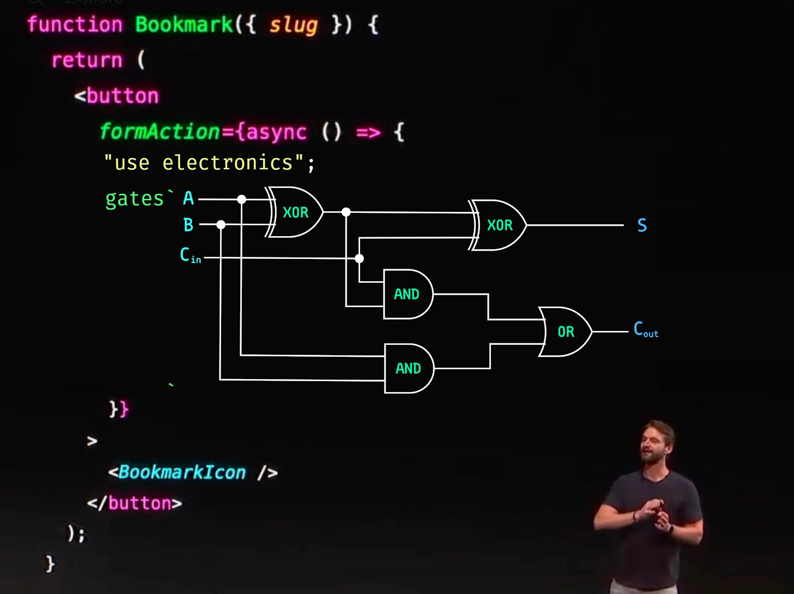

# Is React Still a UI Library?

Welcome to React Holiday '23 🥳
React has changed. Never content playing second fiddle to PHP, React has wormed it's way into the server-side.

I'm stoked for these changes but don't believe in a one-framework future. And so far, Next.js is the team playing.
I want to focus this year on things that impact all React devs – building exceptional and extensible UI components. And I've found a single component build to do precisely that…
This React Holiday, let's get back to UI. Let's master refs, context, hooks, composition, effective modularization, a11y, and more… Everything I've learned in 10 years of component design and development.
Strap in! Because it's gonna be fast and furious.
❤️ Chan

## Assignment

Implement the simplest version of a ShowMore component that you can.
This will involve a ​button​, ​state​, a couple ​conditionals​, and (to keep it real simple) ​a way to truncate text​.
Share what you make on ​twitter​, ​threads​, ​mastodon​, or ​discord​ 😄
