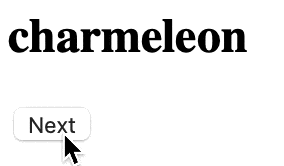

If you have an app that fetches data, you probably use react-query, redux, Apollo, or URQL to fetch data.

When fetching data, you can render components conditionally based on a pending, error, or success state.

`startTransition` (for data-fetching) introduces a new state: stale. That isn’t official language but it’s how I think about it. `startTransition` can keep a stale render in view while resolving the next view.

Check out the onClick handler from [yesterday’s StackBlitz demo](https://stackblitz.com/edit/react-ky1gmq). Without `startTransition`, the view disappears from the screen as soon as the “Next” button is clicked.

When we wrap our actions in `startTransition`, the “stale” view sticks around until the next view either errors or resolves. This is a much more stable user experience.

Check out the code and comments in [today’s StackBlitz demo](https://stackblitz.com/edit/react-h6gei7?file=src/App.js).

`startTransition` is powerful but limited!  
Next, we'll see how `useTransition` can help us style the "stale" view..

🐦 [chantastic](https://chan.dev/twitter)

[⬅️ back](/lessons/reactholiday/2021/15)

[forward ➡️](/lessons/reactholiday/2021/17)

