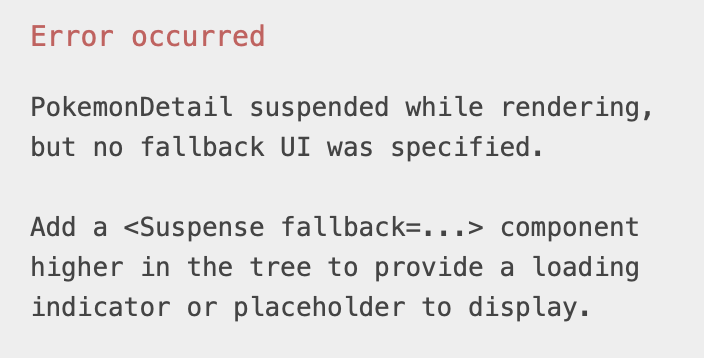

Every time I teach suspense, folks feel an immediate need to collapse suspense and error boundaries into suspending view components.

I respect that urge but fight it.

Suspense and error boundary are designed to be mixed, matched, moved around for different experiences. They're intentionally separated.

In fact, if we move suspense and error boundary components into the `PokemonDetail` render function, we'll see a curious error.

The boundaries are ignored.  
This is because suspense boundaries only catch outside of a suspending component's definition.

Open [today's StackBlitz demo](https://stackblitz.com/edit/react-n7n1xq?file=src/App.js) and play with the boundaries.  
Make it break and get a sense of what is and isn't allowed.

🐦 [chantastic](https://chan.dev/twitter)

[⬅️ back](/lessons/reactholiday/2021/21)

[forward ➡️](/lessons/reactholiday/2021/23)

