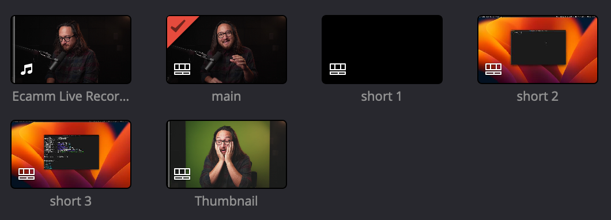
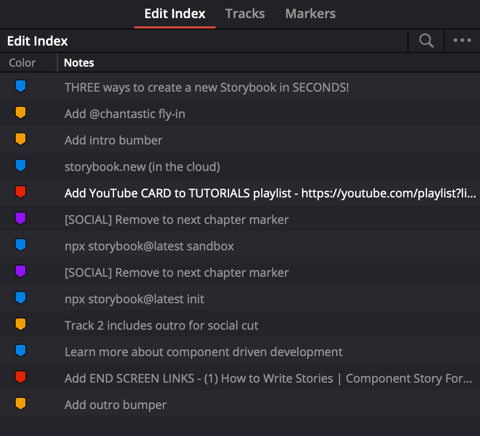
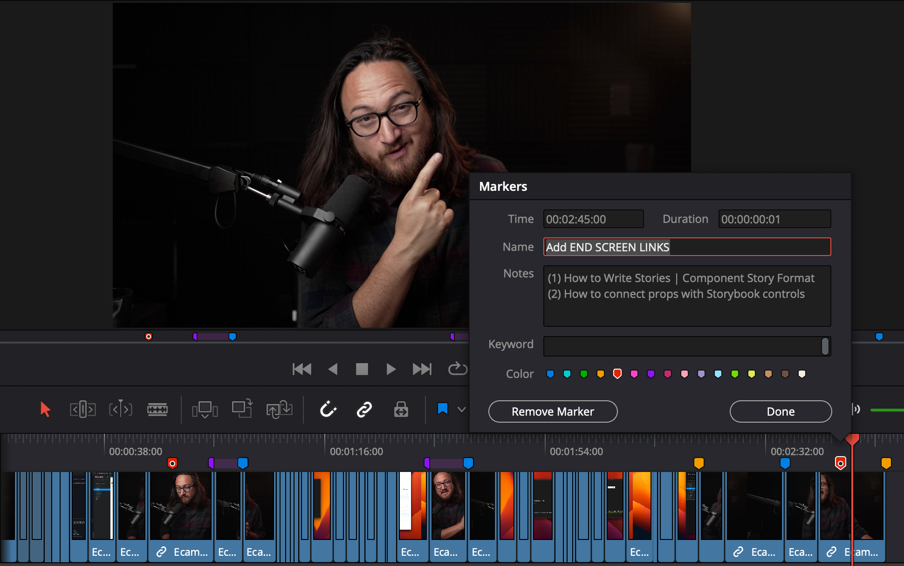

## Contents

## Files

I deliver three files:

1. Source video
2. DaVinci Resolve project file
3. Video Thumbnail thumbnail

## Timelines

`main`
: The timeline used for primary YouTube upload.
: This timeline is also used [with notes](#markers) to create a 2:20 cut for Twitter, and LinkedIn.

`short {n}`
: Timelines for vertical format short-form uploads.

`thumbnail`
: Used to grab stills for YouTube thumbnail.

## Markers

I use markers to indicate _edits_, _YouTube features_.

🟨 Edit marker
: Where to include intros and outros.
: Transitions that may need to be tidied up.
: Assets to display on screen.
: Important visual transitions.

🟦 Chapter marker
: Timestamps YouTube description.
: _The first blue marker is the title of the video._

🟥 YouTube upload feature
: Cards, end-screen elements, preferred thumbail (#shorts).
: Links (or video titles) provided where needed.

🟪 Optional cuts
: These sections can be cut without meaningful loss to learning outcome.
: Cut these sections first to make shorter social exports.

**NOTE:**
Be aware that edits to the content may cause timestamps to drift.
Please verify that they remained at the sections they mark.

## Formats

| Target  | Format | Orientation | Thumbnail                    |
| ------- | ------ | ----------- | ---------------------------- |
| YouTube | 4k     | Horizontal  | Upload                       |
| Social  | FHD    | Horizontal  | First frame                  |
| #shorts | FHD    | Vertical    | Select in YouTube mobile app |
