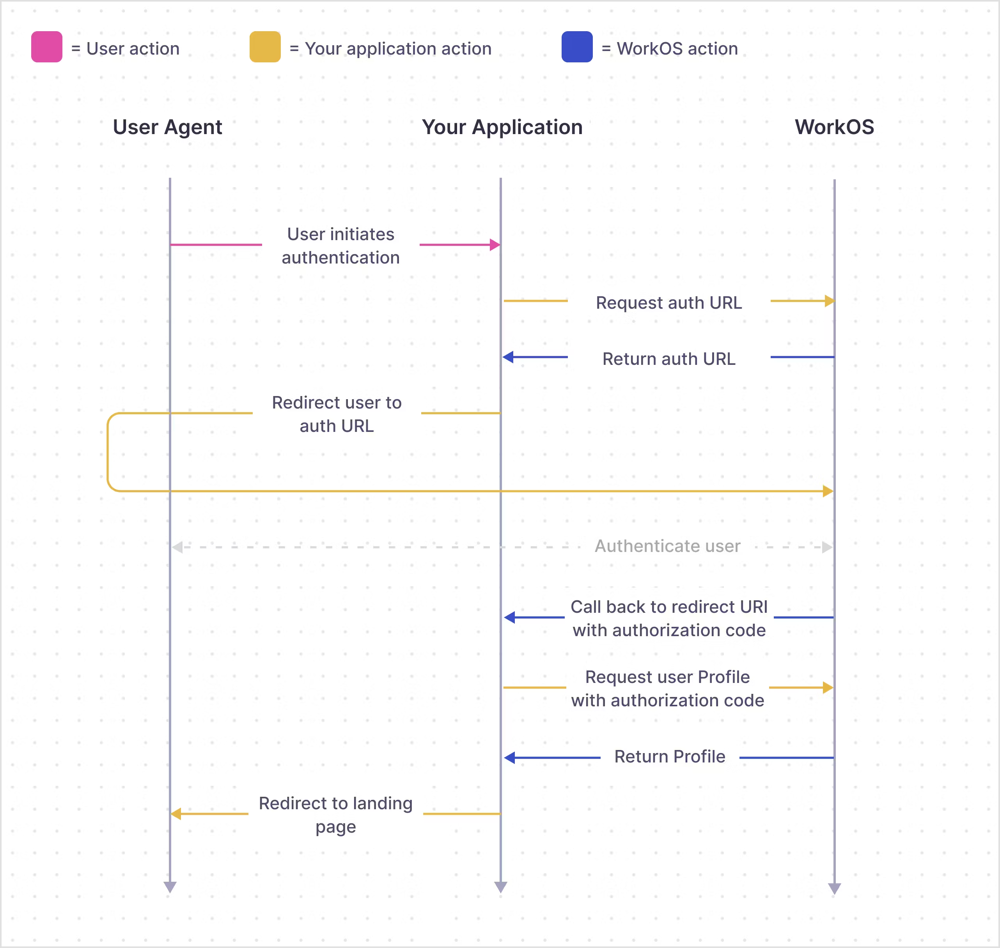

These instructions are a step-by-step guide to setting up AuthKit with Astro. Each step will result in some observable change that should illustrate completion.

The guide tracks each steup of the WorkOS SSO authentiaction flow:



## Warning

As of this writing, `@workos-inc/node` [v7 has an issue that causes it to fail in Cloudflare Workers](https://github.com/workos/workos-node/issues/1070).

The current workaround is to downgrade to v6 — which has everything needed for this tutorial.

## Set up environment

### Install WorkOS Node SDK

```bash
npm i @workos-inc/node
```

### Set secrets in local environment

```txt title=".env.local"
WORKOS_API_KEY=#COPY FROM WORKOS DASHBOARD
WORKOS_CLIENT_ID=#COPY FROM WORKOS DASHBOARD
WORKOS_REDIRECT_URI=#LOCAL PATH TO AUTH CALLBACK ENDPOINT
WORKOS_COOKIE_PASSWORD=#32 RANDOM CHARACTER PASSWORD
```

## Direct users to Hosted AuthKit

### Create /sign-in redirect endpoint

```ts title="src/pages/sign-in.ts"
import type {APIRoute} from 'astro'

export const GET: APIRoute = async () => {
	return new Response(
		'/sign-in redirect endpoint. Not Implemented.'
	)
}

// disable prerendering in 'hyrbrid' mode
export const prerender = false
```

### Generate the authorization URL

```diff lang="ts" title="src/pages/sign-in.js"
import type {APIRoute} from 'astro'
+import {WorkOS} from '@workos-inc/node'

+const workos = new WorkOS(import.meta.env.WORKOS_API_KEY)

export const GET: APIRoute = async () => {
+	const authorizationUrl =
+		workos.userManagement.getAuthorizationUrl({
+			provider: 'authkit',
+			redirectUri: import.meta.env.WORKOS_REDIRECT_URI,
+			clientId: import.meta.env.WORKOS_CLIENT_ID,
+		})

	return new Response(
-		'/sign-in redirect endpoint. Not Implemented.',
+		authorizationUrl,
	)
}
```

### Redirect user to authorization URL

```ts title="src/pages/sign-in.ts" ins=/{redirect}/ del={9} ins={10}
export const GET: APIRoute = async ({redirect}) => {
	const authorizationUrl =
		workos.userManagement.getAuthorizationUrl({
			provider: 'authkit',
			redirectUri: import.meta.env.WORKOS_REDIRECT_URI,
			clientId: import.meta.env.WORKOS_CLIENT_ID,
		})

	return new Response(authorizationUrl)
	return redirect(authorizationUrl)
}
```

### Final /sign-in redirect endpoint

```ts title="src/pages/sign-in.ts"
import {WorkOS} from '@workos-inc/node'
import type {APIRoute} from 'astro'

const workos = new WorkOS(import.meta.env.WORKOS_API_KEY)

export const GET: APIRoute = async ({redirect}) => {
	const authorizationUrl =
		workos.userManagement.getAuthorizationUrl({
			provider: 'authkit',
			redirectUri: import.meta.env.WORKOS_REDIRECT_URI,
			clientId: import.meta.env.WORKOS_CLIENT_ID,
		})

	return redirect(authorizationUrl)
}

// required in `hybrid` rendering mode
export const prerender = false
```

---

## Create auth callback endpoint

```ts title="src/pages/auth/callback.ts"
import type {APIRoute} from 'astro'

export const GET: APIRoute = async ({}) => {
	return new Response(
		'Auth callback endpoint. Not implemented.'
	)
}
```

### Extract authentication code request to redirect URI

```ts title="src/pages/auth/callback.ts" ins=/{request}/ del={7} ins={2-4, 8}
export const GET: APIRoute = async ({request}) => {
	const code = String(
		new URL(request.url).searchParams.get('code')
	)

	return new Response(
		'Auth callback endpoint. Not implemented.'
		code
	)
}
```

### Exchange authorization code for user Profile

```diff lang="ts" title="src/pages/auth/callback.ts"
import type {APIRoute} from 'astro'
+import {WorkOS} from '@workos-inc/node'

+const workos = new WorkOS(import.meta.env.WORKOS_API_KEY)

export const GET: APIRoute = async ({request}) => {
	const code = String(
		new URL(request.url).searchParams.get('code')
	)

+	const session =
+		await workos.userManagement.authenticateWithCode({
+			code,
+			clientId: import.meta.env.WORKOS_CLIENT_ID,
+		})

-	return new Response(code)
+	return new Response(JSON.stringify(session))
}
```

## Encrypt session

```diff lang="ts" title="src/pages/auth/callback.ts"

import type {APIRoute} from 'astro'
import {WorkOS} from '@workos-inc/node'
+import {sealData} from 'iron-session'

const workos = new WorkOS(import.meta.env.WORKOS_API_KEY)

export const GET: APIRoute = async ({request}) => {
	const code = String(
		new URL(request.url).searchParams.get('code')
	)
	const session =
		await workos.userManagement.authenticateWithCode({
			code,
			clientId: import.meta.env.WORKOS_CLIENT_ID,
		})

+	const encryptedSession = await sealData(session, {
+		password: import.meta.env.WORKOS_COOKIE_PASSWORD,
+	})

-	return new Response(session)
+	return new Response(encryptedSession)
}
```

### Set cookie, using encrypted session

```diff lang="ts" title="src/pages/auth/callback.ts"
export const GET: APIRoute = async ({
	request,
+	cookies,
}) => {
	const code = String(
		new URL(request.url).searchParams.get('code')
	)
	const session =
		await workos.userManagement.authenticateWithCode({
			code,
			clientId: import.meta.env.WORKOS_CLIENT_ID,
		})

	const encryptedSession = await sealData(session, {
		password: import.meta.env.WORKOS_COOKIE_PASSWORD,
	})

+	cookies.set('wos-session', encryptedSession, {
+		path: '/',
+		httpOnly: true,
+		secure: true,
+		sameSite: 'lax',
+	})

	return new Response(encryptedSession)
}
```

### Redirect user to authenticated route

```diff lang="ts" title="src/pages/auth/callback.ts"
export const GET: APIRoute = async ({
	request,
+	redirect,
	cookies,
}) => {
	const code = String(
		new URL(request.url).searchParams.get('code')
	)
	const session =
		await workos.userManagement.authenticateWithCode({
			code,
			clientId,
		})

	const encryptedSession = await sealData(session, {
		password: import.meta.env.WORKOS_COOKIE_PASSWORD,
	})

	cookies.set('wos-session', encryptedSession, {
		path: '/',
		httpOnly: true,
		secure: true,
		sameSite: 'lax',
	})

-	return new Response(encryptedSession)
+	return redirect('/dashboard')
}
```

### Final auth callback endpoint

```ts title="src/pages/auth/callback.ts"
import type {APIRoute} from 'astro'
import {WorkOS} from '@workos-inc/node'
import {sealData} from 'iron-session'

const workos = new WorkOS(import.meta.env.WORKOS_API_KEY)

export const GET: APIRoute = async ({
	request,
	redirect,
	cookies,
}) => {
	const code = String(
		new URL(request.url).searchParams.get('code')
	)
	const session =
		await workos.userManagement.authenticateWithCode({
			code,
			clientId: import.meta.env.WORKOS_CLIENT_ID,
		})

	const encryptedSession = await sealData(session, {
		password: import.meta.env.WORKOS_COOKIE_PASSWORD,
	})

	cookies.set('wos-session', encryptedSession, {
		path: '/',
		httpOnly: true,
		secure: true,
		sameSite: 'lax',
	})

	return redirect('/dashboard')
}

// required in `hybrid` rendering mode
export const prerender = false
```

---

## Create single protected page

```astro title="src/pages/dashboard.astro"
---
// disable prerendering in 'hyrbrid' mode
export const prerender = false
---

<pre><code>{JSON.stringify('Not implemented.', null, '\t')}</code></pre>
```

### Read encrypted session from cookie. Redirect in not present.

```astro title="src/pages/dashboard.astro" ins={5-9} del=/"Not implemented"/ ins=/"(cookie),/
---
// disable prerendering in 'hyrbrid' mode
export const prerender = false

const cookie = Astro.cookies.get('wos-session')

if (!cookie) {
	return Astro.redirect('/sign-in')
}
---
<pre><code>{JSON.stringify("Not implemented"cookie, null, '\t')}</code></pre>
```

### Decript session

```astro title="src/pages/dashboard.astro" ins={2, 13-15} del=/(cookie)session/ ins=/cookie(session)/
---
import {unsealData} from 'iron-session'

// disable prerendering in 'hyrbrid' mode
export const prerender = false

const cookie = Astro.cookies.get('wos-session')

if (!cookie) {
	return Astro.redirect('/sign-in')
}

const session = await unsealData(cookie.value, {
	password: import.meta.env.WORKOS_COOKIE_PASSWORD,
})
---
<pre><code>{JSON.stringify(cookiesession, null, '\t')}</code></pre>
```

### Verify the user session with a JWT

```diff lang="astro" title="src/pages/dashboard.astro" del=/(session)verifiedSession/ ins=/session(verifiedSession)/
---
+import {WorkOS} from '@workos-inc/node'
+import {createRemoteJWKSet, jwtVerify} from 'jose'

import {unsealData} from 'iron-session'

const cookie = Astro.cookies.get('wos-session')

if (!cookie) {
	return Astro.redirect('/sign-in')
}

const session = await unsealData(cookie.value, {
	password: import.meta.env.WORKOS_COOKIE_PASSWORD,
})

const workos = new WorkOS(import.meta.env.WORKOS_API_KEY)

+const JWKS = createRemoteJWKSet(
+	new URL(
+		workos.userManagement.getJwksUrl(
+			import.meta.env.WORKOS_CLIENT_ID
+		)
+	)
+)

+let verifiedSession = await jwtVerify(session.accessToken, JWKS)

export const prerender = false
---

<pre><code>{JSON.stringify(sessionverifiedSession, null, '\t')}</code></pre>

```

### Redirect to /sign-in route if session is invalid

```diff lang="ts" title="src/pages/dashboard.astro"
-let verifiedSession = await jwtVerify(session.accessToken, JWKS)
+let verifiedSession
+
+try {
+	verifiedSession = await jwtVerify(session.accessToken, JWKS)
+} catch (e) {
+	return Astro.redirect('/sign-in')
+}
```

### Display session data

```diff lang="astro" title="src/pages/dashboard.astro"
-<pre><code>{JSON.stringify(verifiedSession, null, '\t')}</code></pre>
+<h1>Hello {session.user.lastName}!</h1>
```

### Final protected user page

```ts title="src/pages/dashboard.ts"
---
import {WorkOS} from '@workos-inc/node'
import {createRemoteJWKSet, jwtVerify} from 'jose'

import {unsealData} from 'iron-session'

const cookie = Astro.cookies.get('wos-session')

if (!cookie) {
	return Astro.redirect('/sign-in')
}

const session = await unsealData(cookie.value, {
	password: import.meta.env.WORKOS_COOKIE_PASSWORD,
})

const workos = new WorkOS(import.meta.env.WORKOS_API_KEY)

const JWKS = createRemoteJWKSet(
	new URL(
		workos.userManagement.getJwksUrl(
			import.meta.env.WORKOS_CLIENT_ID
		)
	)
)

let verifiedSession

try {
	verifiedSession = await jwtVerify(session.accessToken, JWKS)
} catch (e) {
	return Astro.redirect('/sign-in')
}

export const prerender = false
---

<h1>Hello {session.user.firstName} {session.user.lastName}!</h1>
```

---
