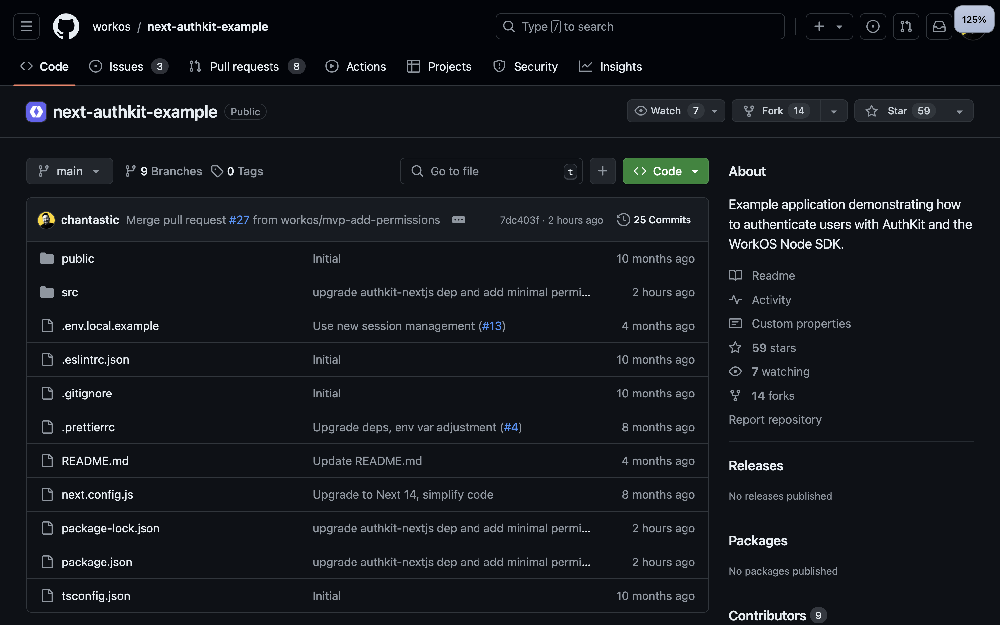
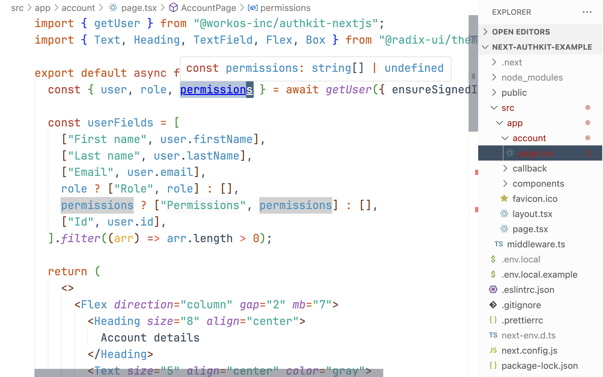
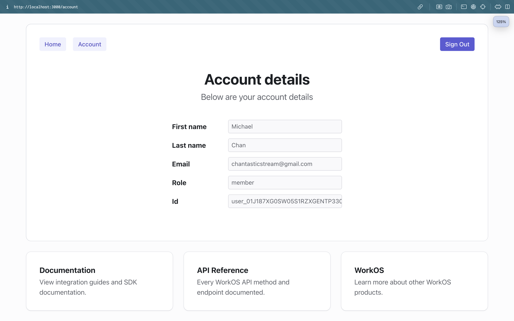
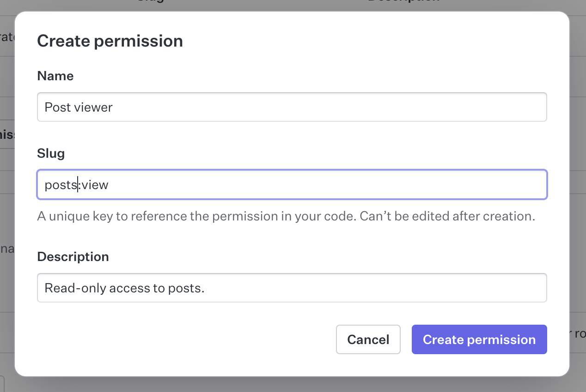
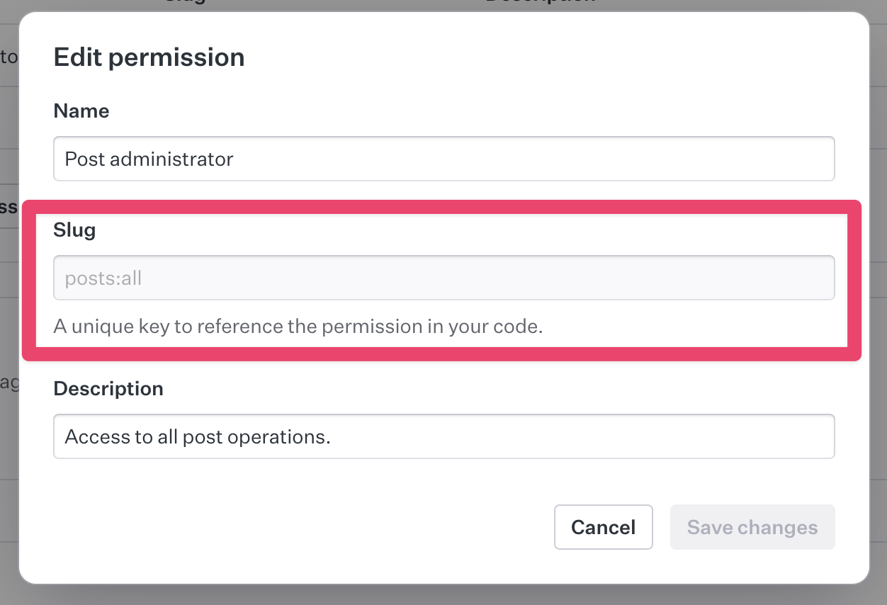
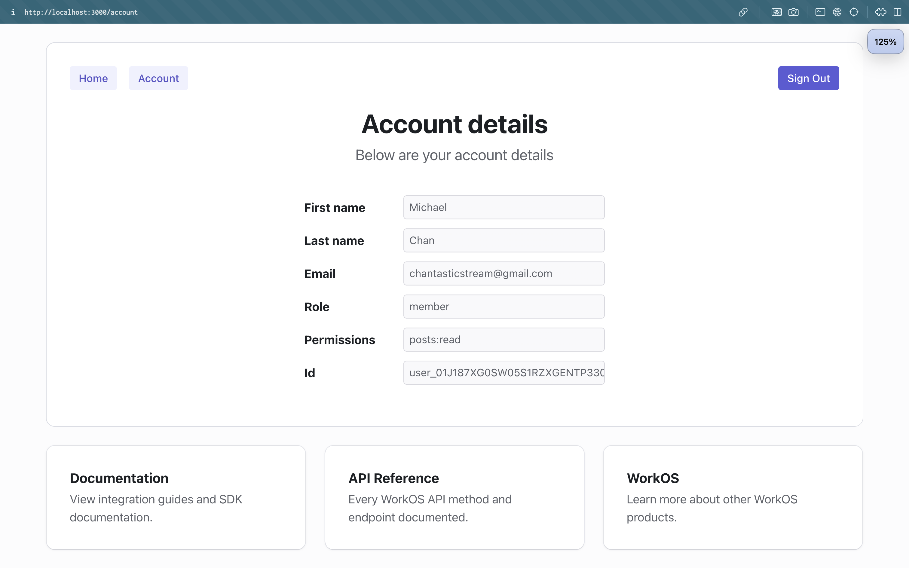
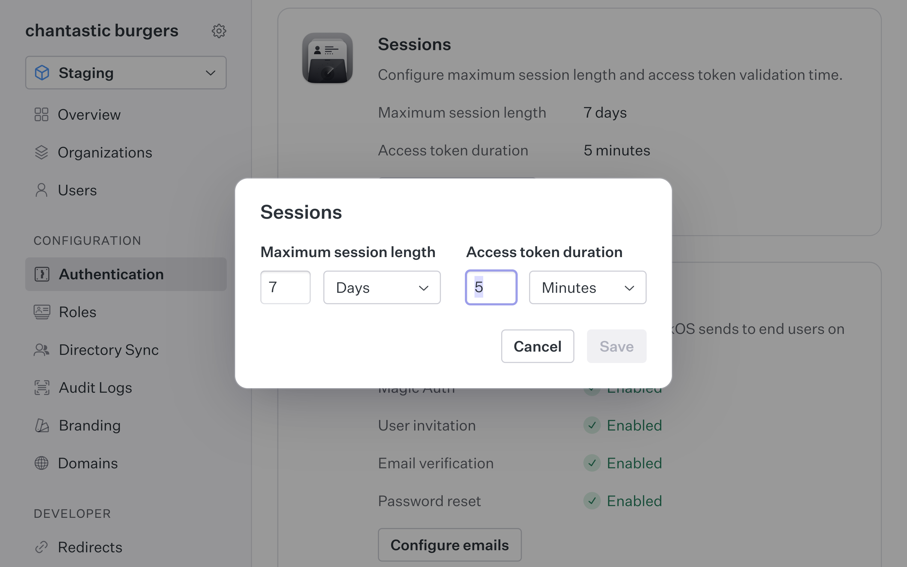
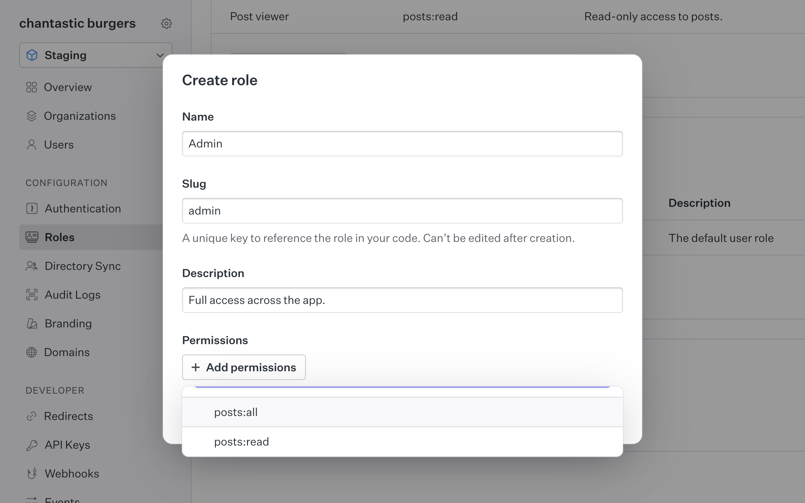
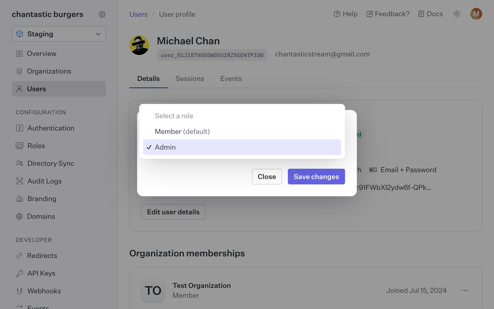
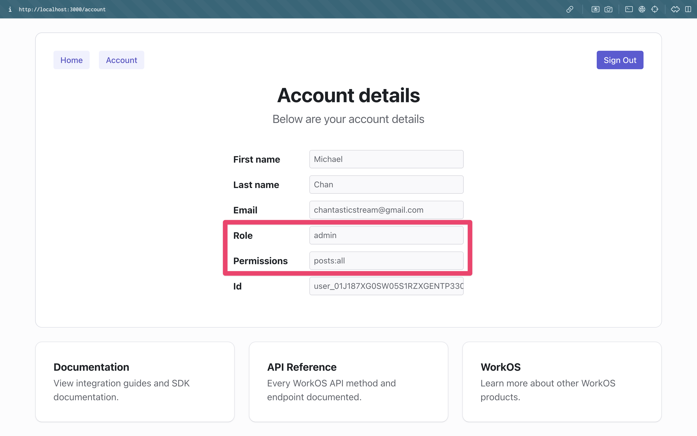

AuthKit now has permissions — completing the RBAC feature set.

This is everything you need to know to start implementing authorization in your applications.

## Video tutorial

<iframe width="560" height="315" src="https://www.youtube.com/embed/FErRN9EsKTo?si=7SE3Hf3KG-bx6F7b" title="YouTube video player" frameborder="0" allow="accelerometer; autoplay; clipboard-write; encrypted-media; gyroscope; picture-in-picture; web-share" referrerpolicy="strict-origin-when-cross-origin" allowfullscreen></iframe>

Chapters:

- [Set up the example app (Next.js)](https://www.youtube.com/watch?v=FErRN9EsKTo&feature=shared&t=14s)
- [Permissions exist on sessions](https://www.youtube.com/watch?v=FErRN9EsKTo&feature=shared&t=25s)
- [Create new permissions in WorkOS](https://www.youtube.com/watch?v=FErRN9EsKTo&feature=shared&t=49s)
- [Add permissions to roles](https://www.youtube.com/watch?v=FErRN9EsKTo&feature=shared&t=120s)
- [Understand session duration](https://www.youtube.com/watch?v=FErRN9EsKTo&feature=shared&t=154s)
- [Create and assign permissions to roles](https://www.youtube.com/watch?v=FErRN9EsKTo&feature=shared&t=175s)
- [Implement permission checks in your app](https://www.youtube.com/watch?v=FErRN9EsKTo&feature=shared&t=212s)
- [Where to learn more…](https://www.youtube.com/watch?v=FErRN9EsKTo&feature=shared&t=225s)

---

## Setup

For this lesson, we're using the latest [next-authkit-example](https://github.com/workos-inc/next-authkit-example) app.

## Sessions include `permissions`

Permissions are available on AuthKit session object.

Opening the next-authkit-example, we see that `permissions` is an array of strings.
And that the property is parallel to the `user` and `role` properties.

Running the app, we can sign in to see a few session details but no permissions.

This property is empty, when no permissions are assigned.
So, let's add couple permissions in the WorkOS Dashboard.

## Add permissions is the WorkOS Dashboard

Navigate to the Roles tab (in the WorkOS Dashboard).

Create a new permission with:

- `Name`: A colloquial name.
- `Slug`: The value that will be stored on the session and used for authorization.
- `Description`: An optional field for additional permission details and instructions.

I'll add two permissions:

- `posts:read`
- `posts:all`

The firt for read-only and the second for full CRUD.

_Note that the slugs can't be changed after creation._

## Assign permissions to roles

Permissions cannot be directly assigned to users.  
They're applied to users thru roles.

By default, every user in AuthKit gets a `Member` role.
Let's update the `Member` role to include compose the `posts:read` permission.

Back in our app, let's sign out and back in again to see the updated permissions.

_Note: We're logging out to force a fresh session. The access token duration setting dictates the rate at which a session is refreshed. This is set in Authentication > Sessions)._

## Assign a new role to a user

Back in our WorkOS dashboard, let's create an Admin role, and assign the `posts:all` permission to it.

Then change our user's role from `Member` to `Admin`.

Log out and back in again to force a session refresh.  
And see both the new role and permissions!

## A couple things to note

- You need to upgrade to the latest version of the WorkOS SDK for the update User type.
- Our doc on [Roles and Permissions](https://workos.com/docs/user-management/roles-and-permissions) includes a number of best practices for your projects. Including suggestions for role assignment for SCIM integrations.
