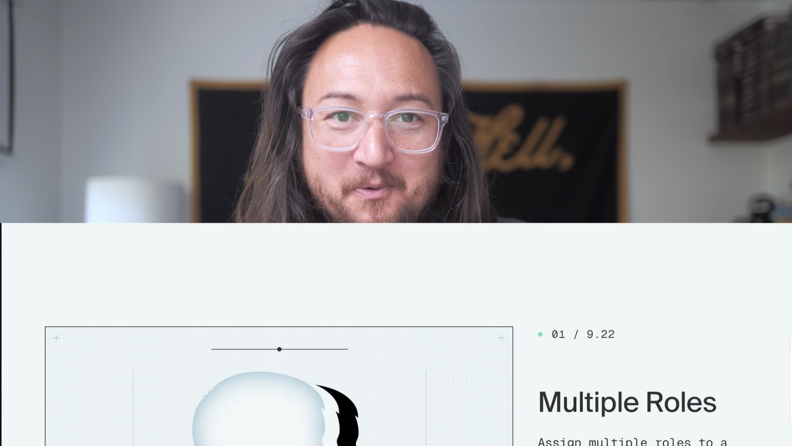

## Face

## Titles

Hard cut.  
Keep them right on top.  
Shoot for about 3 seconds.  
But more importantly, tie them to speech (where you here punctuation: `,`, `.`, `;`, `!`, `?`).  
Use a J-cut out.

## Keywords

Put them on screen with a big blocky font in heavy weight.

## Transition: face-to-display

Use a slide-up transition.  
Keep the face stable.

This works because

## Transition: display-to-face

Don't bother.  
Just a J-cut.

## Transition: display-to-display

Use a push transition.

- 1-to-2, push-left
- 2-to-1, push-right

Try and keep track of which is which so there's consistency between display changes.

---

## Other

### Audio

- normalize (YouTube), this one is mostly to make music and sfx volume matching easier.

### Export

- normalize (YouTube)
