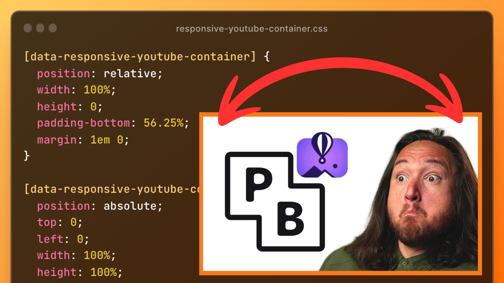

YouTube makes it easy to copy-paste a video embed.
LOVE THAT!

But, the default embed isn't responsive so it is guaranteed to look shit wherever you embed it.

I've dragged this snippet around the internet with me for years.

```css
/* youtube embed wrapper */
[data-responsive-youtube-container] {
	position: relative;
	width: 100%;
	height: 0;
	padding-bottom: 56.25%;
	margin: 1em 0;
}

[data-responsive-youtube-container] > iframe {
	position: absolute;
	top: 0;
	left: 0;
	width: 100%;
	height: 100%;
}
```

I adapted it to use [AVO 🥑 CSS](/avo-a-bem-dialect-using-data-attributes/ 'AVO 🥑 — a data attribtues dialect of BEM'), my data attributes specification of [BEM](https://en.bem.info/methodology/css/ 'BEM — a CSS mothodology').
But I didn't write the styles.
I hate magic numbers like `56.25%`, and I would have tried to avoid it until giving up 😆

## Usage

1. Copy a YouTube embed from the share sheet.
2. Paste that embed in an HTML or markdown file.
3. Wrap it in a block-element container with the `data-responsive-youtube-container` selector.
4. Enjoy container-aware responsive videos!

```html
<div data-responsive-youtube-container>
	<iframe
		width="560"
		height="315"
		src="https://www.youtube.com/embed/u63pOK6Zyog"
		title="YouTube video player"
		frameborder="0"
		allow="accelerometer; autoplay; clipboard-write; encrypted-media; gyroscope; picture-in-picture; web-share"
		allowfullscreen
	></iframe>
</div>
```

It'll look like this:

<div data-responsive-youtube-container>
<iframe width="560" height="315" src="https://www.youtube-nocookie.com/embed/u63pOK6Zyog?si=BP0pfZSR1lpH5vzR" title="YouTube video player" frameborder="0" allow="accelerometer; autoplay; clipboard-write; encrypted-media; gyroscope; picture-in-picture; web-share" allowfullscreen></iframe>
</div>

Embed responsively!

## Bonus

This works with layouts as well.
Around [chan.dev](/marchdown/container-plugin 'A chantastic lesson on how I create custom containers in markdown'), you'll see this paired with a flex and grid layout.

[chan.dev]: https://chan.dev "chan.dev — a home for chantastic's creative chaos"

## Help me attribute this

If you know where I originally swiped this from, let me know so I can give the author credit here.

I'm `@chantastic` on twitter and discord.

<div id="social">

tweet:  
Embed responsively 🍻  
How I embed YouTube videos with range…

alt:  
embed responsively! css snippet from chan.dev showing how to embed YouTube videos responsively



</div>
