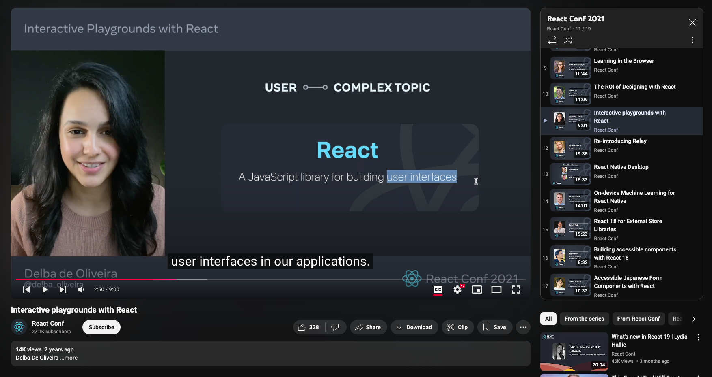
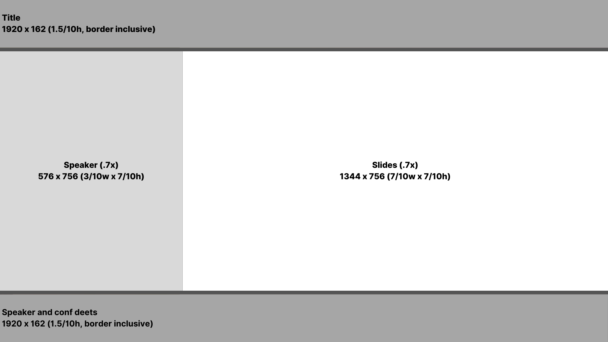
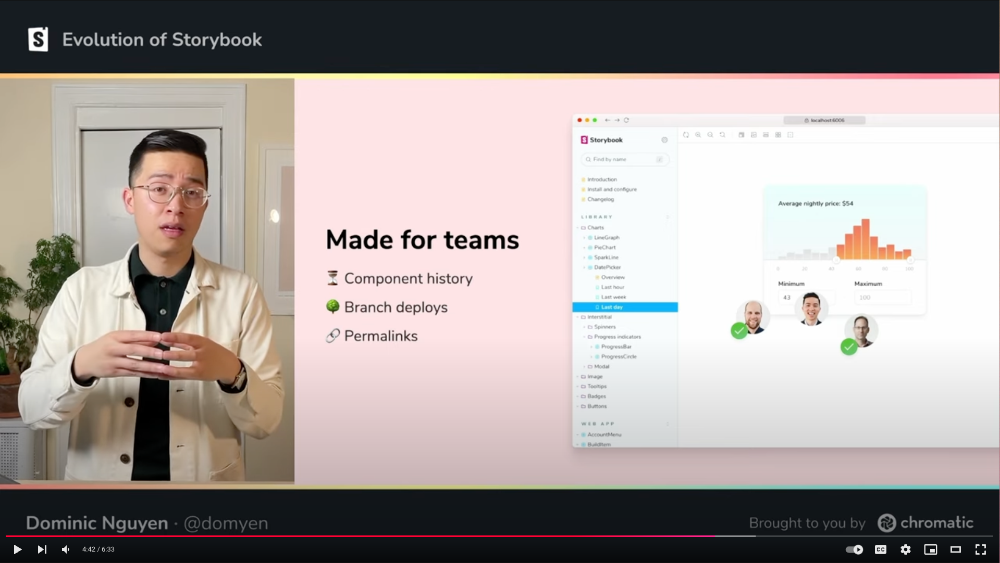

Back in 2021 the [React](https://react.dev/community/team) team put together a great online event.

They used a layout that that I've used to style conference content for [Storybook][Storybook Day] and [WorkOS]().

I finally got smart and broke it down into repeatable, mathematical template.



This is how I broke it down…

- Layout forms a 10x10 grid
- Content is scaled down to 70%, by height

Here are the dimensions (in grid unites):

```
[1.5] Title
[7  ] Content
  [3] Speaker | [7] Content
[1.5] Speaker and conf deets
```



For the [Storybook Day][] conference, we found that a dark background was least distracting.

We also added a thematic border, for a nice transition to bright content.

~12px pixels of height works well for the border (taken from the header and footer dimensions).

Finally, use a monochromatic logo, if you don't have full control over presentation styling.



[storybook day]: https://www.youtube.com/@chromaticuihttps://www.youhttps://www.youtube.com/@workostube.com/@chromaticui

---

I'm working on how best to set this up in DaVinci Resolve.

Here are the parts I'm working with so far:

- Fusion Clip
  - Merge clips
    - Layout image as background (to set size)
    - Presentation source
      - scaled to .7x
      - transformed to match right edge
    - Speaker source @ .7x
      - scaled to .7x
      - cropped to .3x width (centered)
      - transformed to match left edge
