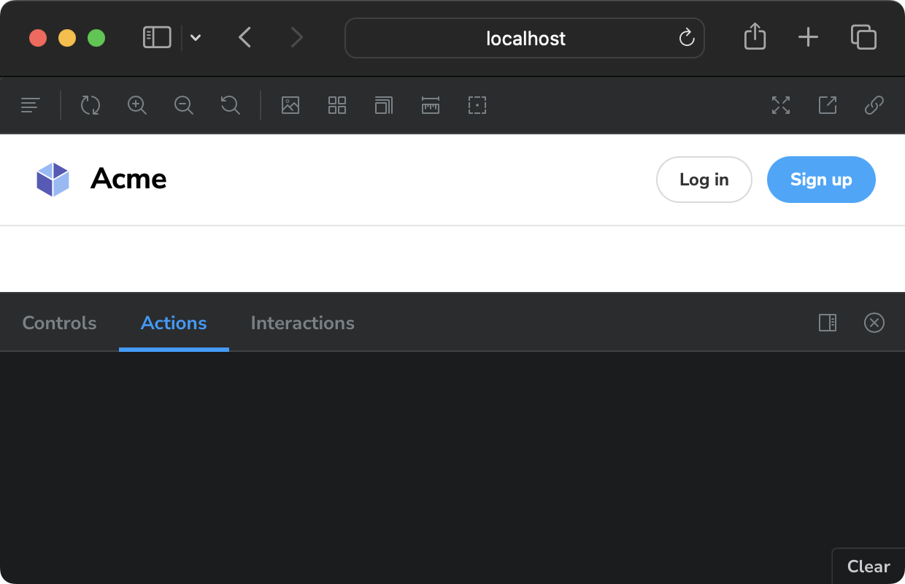
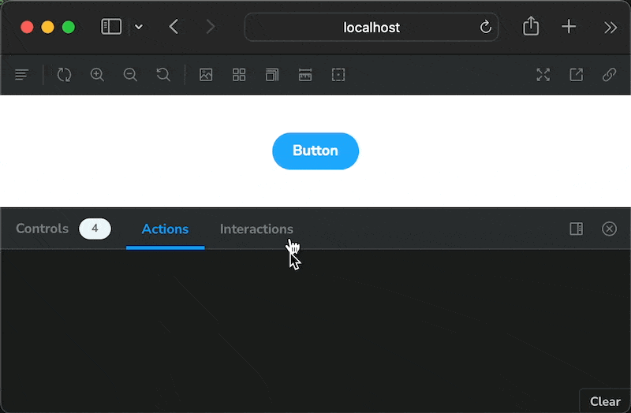
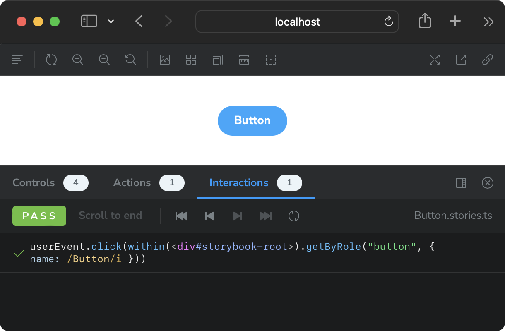

Let's talk about `console.log`-driven development.
We all do it.
So, instead of fighting it, let's _upgrade_ it with Storybook Actions.

:::hidden-script

Let's dive in…
:::

## Feature instability and mitigations

Storybook actions are a feature of Storybook 6 and 7.

There's an [active design proposal](https://github.com/storybookjs/storybook/discussions/23649) to make them work like conventional testing mocks. This would be a welcome change, imo.

Knowing that a change is on the horizon, let's focus on the features of the current API that will remain (or migrate easily with codemods).

## Feature Overview

In a fresh Storybook 7 installation ([sandboxes here](https://storybook.new/)), we find two example components configured to use Storybook actions.

The included Button stories log the common event — `onClick` — when clicked. Logs can then be expanded to show full event details.


​
Heading stories also log events but this time with custom events `onLogin` and `onCreateAccount`. These events are logged when the respective buttons are clicked.


<!-- The Page stories are different. Even though they compose the Heading and Button components, no events are logged. This happens because the event callback props aren't part of the Page component interface.

 -->

Actions pair perfectly with [Storybook interactions][]. Interactions are a way to document component states thru simulated user input. Interactions trigger their corresponding actions.

[Storybook interactions]: https://storybook.js.org/docs/react/essentials/interactions#page-top


:::hidden-script

Upgrade your `console-log`-driven development workflow with Storybook Actions.

Storybook actions can log event details, across stories, for both common and custom events.

(full segment script)

We have more videos on how to use this. So follow for more component-driven development tips.
:::

## Add actions with argTypes

Let's define actions for the example Button component.

- Open the story file and locate component `meta`.
- Add an `argTypes` property if one doesn't exist.
- Add an `onClick` property (this needs to match the component prop name).
- Set the value to `{ action: "clicked" }`. (The logged text can be anything we like.)

```tsx ins={9}
// Button.stories.tsx
// (surronding code omitted)
const meta = {
  title: "Example/Button",
  component: Button,
  tags: ["autodocs"],
  argTypes: {
    backgroundColor: { control: "color" },
    onClick: { action: "onClick" },
  },
} satisfies Meta<typeof Button>;
```

Now click your button in Storybook and watch the Actions log!



:::hidden-script

Inspect actions in Storybook without litering your implementation with `console.log` statements!

(full segment script)

This is a great way to test and log event data without touching implementation code.

We have more videos on how to use this. So follow for more component-driven development tips.
:::

## Test actions with interactions

Let's add an interaction to the example Button component.

- Create or find a new story.
- Add a `play` function to the story object.
- Within the `canvasElement`, find the button.
- then simulate a click event.

```tsx ins={6-12}
// Button.stories.tsx
// (surronding code omitted)
export const Primary: Story = {
  args: {
    primary: true,
    label: "Button",
  },
  play: async ({ canvasElement }) => {
    const canvas = within(canvasElement);
    const button = await canvas.getByRole("button", {
      name: /Button/i,
    });
    await userEvent.click(button);
  },
};
```

Now the story will run the interaction when it loads. Logging both the interaction and the action — in their respective tabs.



:::hidden-script

Storybook actions and interactions are a match made in heaven.
:::

## Lessons learned

`console.log`-driven development is something I do when driving out a component implementation. It's a quick, cheap way to ensure that events are hooked up (early in the process).

But log statements has one **huge drawback**: they live in component code. And I'm guilty of pushing a log (or a few dozen) into production.

Storybook actions let you validate implementation in story files, leaving component code alone.
