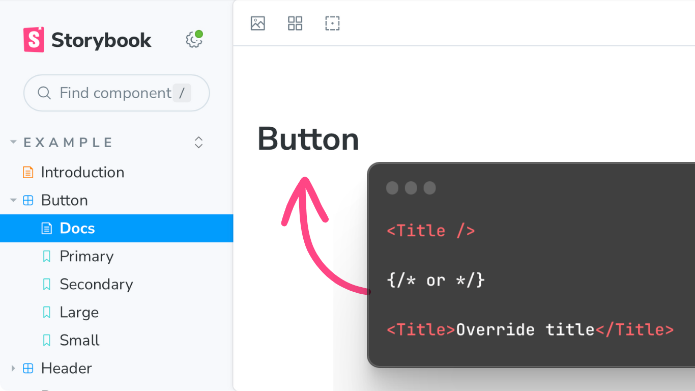

<div data-responsive-youtube-container>

https://youtu.be/uAA1JvLcl-w

</div>

Storybook [doc blocks][] help you document and share UI components with generated **interface documentation**,
**interactive playgrounds**,
and **copy-pasteable source code**.

Let's take a look at **all** the [doc blocks][] _you_ can use to quickly document and share UI components.

:::hidden-script

Let's dive in…
:::

## Prerequisite

[Doc blocks][] are used in custom [docs page templates][] and [MDX documentation][].  
If you're not familiar with those Storybook features, check out these 3 minute introduction videos.

<div class="flex gap-x-3">
  <div class="w-1/2">
<div data-responsive-youtube-container>

https://youtu.be/q8SY4yyNE6Q

</div>
  </div>
  <div class="w-1/2">
<div data-responsive-youtube-container>

https://youtu.be/BLUmt0j7OLY

</div>
  </div>
</div>

## Setup

I'm working in a CSF file,
using a custom docs page template.

<!-- prettier-ignore -->
```jsx
// Button.stories.jsx
// Found in /examples after `npm storybook init`

import type { Meta, StoryObj } from "@storybook/react";

const meta = {
  title: "Example/Button",
  component: Button,
  parameters: {
    docs: {
      page: () => (
        <>
          {/* 👷 WORKING HERE 👷 */}
        </>
      ),
    },
  },
};

export default meta;

export const Primary: Story = {
  args: {
    primary: true,
    label: "Button",
  },
};

export const Secondary: Story = {
  args: {
    label: "Button",
  },
};
```

---

## Generate documentation from source code

Let's start our component documentation with title and description.

First, import doc blocks from `@storybook/blocks` module.

```ts
import {} from "@storybook/blocks";
```

(I'll leave this import block empty — with the expectation that VS Code will import named exports as I use them.)

### Title

The [Title component][] renderes a styled `h1` tag.

Without props, it displays the auto-title or `title`, defined in component `meta`.
But it also accepts `children` if you want to override that default.

<!-- prettier-ignore -->
<!-- ```jsx
<Title />

{/* or */}

<Title>Override title</Title>
``` -->



### Description

The [Description component][] renderes a styled `p` tag.

It displays the JSDoc comment, above the component declaration.
Earlier versions of `Description` took a `children` prop. But this option was deprecated in version 7.

<!-- prettier-ignore -->
```jsx
{/* Uses JSDoc comment description. */}

<Description />

{/* Use of `children` is deprecated in v7, and later. */}
```

### Subtitle

Finally, the [Subtitle component][] renders a styled `h2` tag.

Without props, it displays the component meta value `para$$meters.componentSubtitle`.
And it accepts `children`, for cust./om values.

<!-- prettier-ignore -->
```jsx
<Subtitle />

{/* or */}

<Subtitle>Something else</Subtitle>
```

<section class="hidden-video-script">

**Short #1:**

The Title, Description, and Subtitle components make it possible to keep written documentation in sync with component source code!

This is…  
_How_ to generate documentation from source code, in Storybook.

</section>

---

## Generate copy-pasteable examples and source code

Storbook isn't just a stickerbook of visual components.
You can display source code for every story.
This makes it easy for teammates to copy and paste exactly the code they need.

### Story

The [Story component][] (without props) displays your first story component directly into the document.

```jsx
<Story />
```

### Source

The [Source component][] to display a copy-pasteable snippet of the code used to produce that story.

```jsx
<Source />
```

### Canvas

The [Canvas component][] is like both `Story` and `Source` combined.
It wraps a story in a little box with a collapsable source code accordian.

```jsx
<Canvas />
```

### Pass components using the of prop

All the these story components take an `of` prop, where we can pass a story object.
In this file, we have a `Secondary` story.
So let's add Story, Source, and Canvas, for the `Secondary` story as well.

```diff
<Story />
<Source />
<Canvas />

+ <Story of={Secondary} />
+ <Source of={Secondary} />
+ <Canvas of={Secondary} />
```

Nice.

### `Stories`

It would be a real slog to update our docs page template every time we add or remove Stories.
So Storybook provides a [Stories component][] that renders all of your stories with title and description.

```jsx
<Stories />
```

<section class="hidden-video-script">

**Short #2:**

The Story, Source, and Canvas components give you three different ways to display your components in documentation.
_And_ they make it easy for others to copy and paste precise component source code into their projects.

This is…  
_How_ to generate copy-pasteable source code and examples in Storybook.

</section>

## Genreate interactive documentation

:::hidden-script

**Short #3**

This is…  
_How_ to generate interactive documentation with Storybook.
:::

### `Primary`

And the [Primary component][] displays a full Storybook `Canvas`, with the addition of these zoom and re-render buttons.
And it does so for only the first Story in Storybook.

It's designed for use with interactive docs.

### `ArgTypes`

Table of component props generated by TypeScript and/or JSDoc comment
Learn more in (linked video)

### `Controls`

Like the ArgTypes table with an additional Control column
Where component args are set up, Controls update the Story components above.
Learn more about args and controls in (linked video)

## Display all stories

<section class="hidden-video-script">

**NO SHORT**

</section>

### `Stories`

The [stories component][] renders all the stories contained in a story module — showing off all of the known permutations of your component.
Each with the titles and descriptions of their stories.

## Conclusion

I hope that you're inspired to start communicating your components thru clear, interactive documentation, using Storybook and doc blocks.

The new reference docs on [storybook.js.org][] are incredible. They go into details far beyond what we can cover in quick tips like this.

:::hidden-script

### Video outro

If you'd like to continue learning with me, check out one of these recent videos on related component documentation topics.

That's it for today.
I'm chantastic.
I'll see you in the next one.
Bye!
:::

[storybook.js.org]: https://storybook.js.org/ "Storybook home"
[doc blocks]: https://storybook.js.org/docs/react/writing-docs/doc-blocks "Storybook doc blocks documentation"
[docs page templates]: https://youtu.be/q8SY4yyNE6Q "Storybook docs page templates introduction video"
[mdx documentation]: https://youtu.be/BLUmt0j7OLY "MDX in Storybook introduction video"
[title component]: https://storybook.js.org/docs/react/api/doc-block-title "Title component documentation"
[description component]: https://storybook.js.org/docs/react/api/doc-block-description "Descrsiption component documentation"
[argtypes component]: https://storybook.js.org/docs/react/api/doc-block-argtypes "ArgTypes component documentation"
[subtitle component]: https://storybook.js.org/docs/react/api/doc-block-subtitle "Subtitle component documentation"
[canvas component]: https://storybook.js.org/docs/react/api/doc-block-canvas "Canvas component documentation"
[controls component]: https://storybook.js.org/docs/react/api/doc-block-controls "Controls component documentation"
[primary component]: https://storybook.js.org/docs/react/api/doc-block-primary "Primary component documentation"
[source component]: https://storybook.js.org/docs/react/api/doc-block-source "Source component documentation"
[stories component]: https://storybook.js.org/docs/react/api/doc-block-stories "Stories component documentation"
[story component]: https://storybook.js.org/docs/react/api/doc-block-story "Story component documentation"
