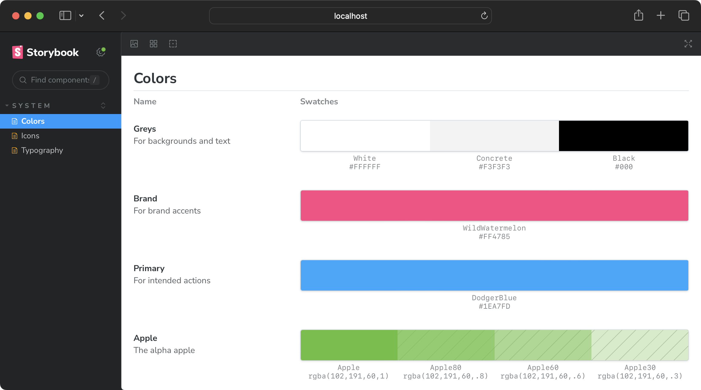
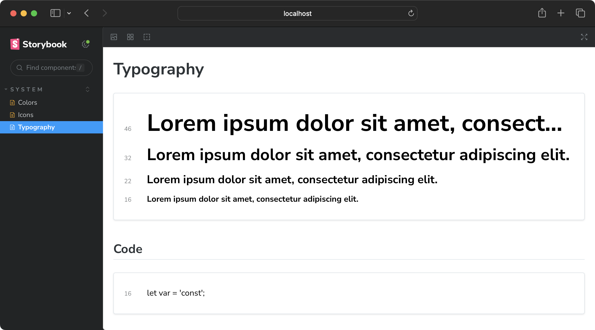
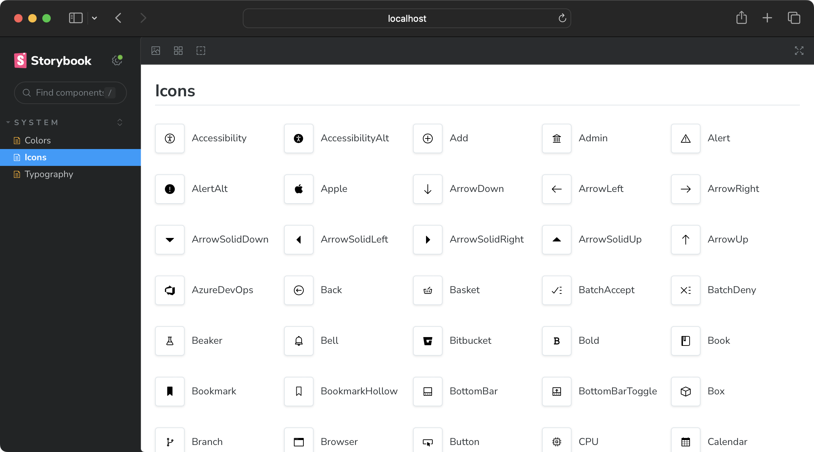

If you document design systems, I'm about to save you a _ton_ of time.
Because Storybook comes with lesser-known components for organizing colors, typography, and icons.

:::hidden-script

Let's dive in…
:::

:::hidden-script

SHORT TEMPLATE:

**pre**  
I love this component for documenting {topic} in Storybook.

**post**  
This is a great pre-baked component for {topic} systems in component libraries and design systems.
:::

## ColorPalette

Display color systems with the `ColorPalette` component.



Import `"@storybook/blocks"`.
Then render a `ColorPalette` with a single `ColorItem` inside.

```mdx
// system/colors.mdx
import { ColorPalette, ColorItem } from "@storybook/blocks"

<ColorPalette>
  <ColorItem />
</ColorPalette>
```

Create an object with a key and color value.
And pass it to the `ColorItem` component via the `color` prop.

_Both key and value are displayed in the UI._

```diff lang="mdx" ins=/colors={.+}/
<ColorItem colors={{ Apple: "#66bf3c" }} />
```

Describe `ColorItems` with `title` and `subtitle` props.

```diff lang="mdx"
<ColorItem
+  title="Apple"
+  subtitle="A delicious brand color."
  colors={{ Apple: "#66bf3c" }}
/>
```

Add as many colors to the `colors` prop as needed.

```diff lang="mdx"
<ColorItem
  title="Apple"
  subtitle="A delicious brand color."
  colors={{
    Apple: "#66bf3c",
+    AppleDark: "#46991f",
+    AppleLight: "#83da5a"
  }}
/>
```

Use any CSS-supported color value.  
`ColorItem` adds gray cross-hatches to indicate translucency — where color functions with non-`1` alpha values are used.

```diff lang="mdx"
<ColorItem
  title="Apple"
  subtitle="A delicious brand color."
  colors={{
+    Apple: "rgba(102,191,60,1)",
+    Apple60: "rgba(102,191,60,.6)",
+    Apple30: "rgba(102,191,60,.3)",
  }}
/>
```

See full [`ColorPalette` API reference](https://storybook.js.org/docs/react/api/doc-block-colorpalette).

## Typeset

Display typography systems with the `Typeset` component.



Import the `Typeset` component from `@storybook/blocks`.

```mdx
// system/typography.mdx
import { Typeset } from "@storybook/blocks";

<Typeset {/* required props */} />
```

`Typeset` requires four props to render: `fontSizes`, `fontWeight`, `sampleText`, and `fontFamily`.

_`fontSizes` and `fontWeight` support any supported CSS value (and numbers)._

```diff lang="mdx"
<Typeset
+  fontSizes={["2.875em", "2em", "1.375em", "1em"]}
+  fontWeight="900"
+  sampleText="Lorem ipsum dolor sit amet, consectetur adipiscing elit."
+  fontFamily='"Nunito Sans", "Helvetica Neue", Helvetica, Arial, sans-serif'
/>
```

Create a new `Typeset` block for every discrete typographical subset.

```diff lang="mdx"
## Code

<Typeset
  fontSizes={[16]}
  fontWeight={400}
  sampleText="let var = 'const';"
  fontFamily='ui-monospace,
             Menlo, Monaco,
             "Cascadia Mono", "Segoe UI Mono",
             "Roboto Mono",
             "Oxygen Mono",
             "Ubuntu Monospace",
             "Source Code Pro",
             "Fira Mono",
             "Droid Sans Mono",
             "Courier New", monospace;'
/>
```

See full [`Typeset` API reference](https://storybook.js.org/docs/react/api/doc-block-typeset).

## IconGallery

Display icons with the `IconGallery` component.



Import `"@storybook/blocks"`.
Then render a `IconGallery` with a single `IconItem` inside it.

```mdx
// system/icons.mdx
import { IconGallery, IconItem } from "@storybook/blocks"

<IconGallery>
  <IconItem></IconItem>
</IconGallery>
```

Place an icon inside `IconItem`.
Then display that icon's name with the `name` prop.

<!-- prettier-ignore -->
```diff lang="mdx" ins=/ name=".+"/
+ import * as Icons from "@storybook/icons";

<IconGallery>
  <IconItem name="Accessibility">
+    <Icons.Accessibility />
  </IconItem>
</IconGallery>
```

Take this further — in React — by dynamically generating all available icons.

```mdx {4-10}
## Storybook icons

<IconGallery>
  {Object.entries(Icons)
    .filter(([name]) => name !== "iconList")
    .map(([name, Icon]) => (
      <IconItem name={name}>
        <Icon />
      </IconItem>
    ))}
</IconGallery>
```

See full [`IconGallery` API reference](https://storybook.js.org/docs/react/api/doc-block-icongallery).

## Learn more…

Find in-depth references for each component on the [Storybook docs page](https://storybook.js.org/docs/) and [Chromatic YouTube channel](https://www.youtube.com/@chromaticui).

:::hidden-script

That's it for today.
Subscribe for more design system and compont library development tips with me.
I'm chantastic and I'll see you in the next one!
:::
