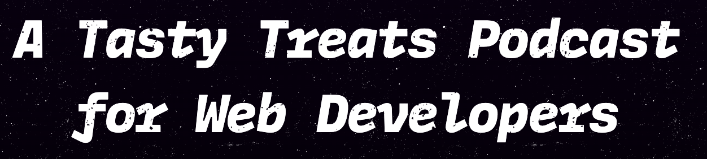

## Style system

https://syntax.fm/system/colors

## Site Heading



```css
h1,
h2,
h3,
h4,
h5,
h6 {
	font-family: MDIO;
	font-weight: 700;
	letter-spacing: -0.04em;
	line-height: 1.4;
	margin-block: 0.2em;
	-webkit-mask-image: url(./Grit\ Mask@2x.25d21248.png);
	mask-image: url(./Grit\ Mask@2x.25d21248.png);
	mask-image-repeat: repeat;
	-webkit-mask-size: 250px;
	mask-size: 250px;
	text-wrap: balance;
	font-style: italic;
}
```

### Font Family

[MD IO](https://www.futurefonts.xyz/mass-driver/io) by [Future Fonts](https://www.futurefonts.xyz/)

https://www.futurefonts.xyz/mass-driver/io?tab=comments

## Grit

## Shorts

### 50/50 slice

https://youtube.com/shorts/fs2VsMvmdOQ?si=B6FhLWdY8JH_8d1l

https://youtube.com/shorts/pQLBAlHzIGc?si=mA_1NMQ2to2CshiQ

https://youtube.com/shorts/BIGWrDq3Lhk?si=z4RNFpgqyU6jcVIv

https://youtube.com/shorts/lRDXOSIWCzw?si=zsc2XD0gh5b5jHuy

https://youtube.com/shorts/BaNuj3gh8-c?si=dJIpSG42HTDTTUSl

icon, middle left
slanted overlay

start with a question or exciting news

The twitter version with overlays https://x.com/syntaxfm/status/1724164372749054375?s=20


### Video

https://www.youtube.com/watch?v=9yiFXnefjks

glitch disappear

black out

To stay up to date with developer news like this, Subscribe to the channel and checkout the Syntax Podcast with new episodes every Monday, Wednesday, and Friday.
