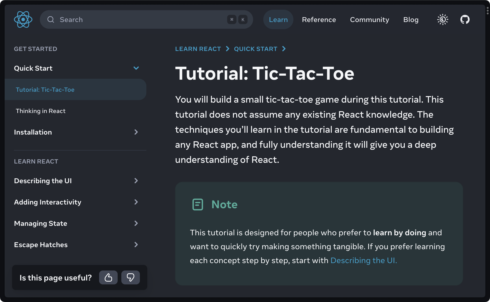
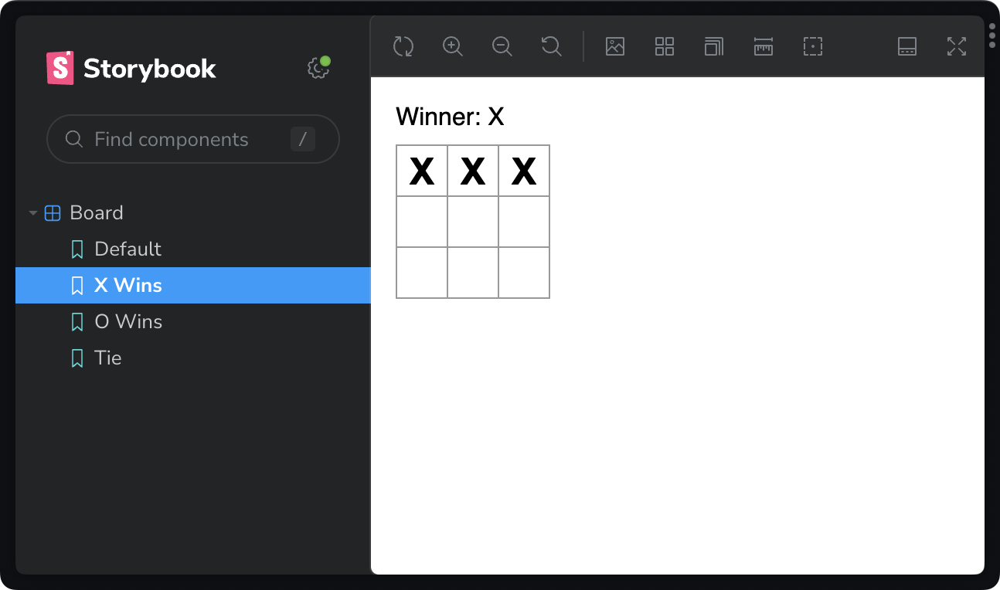
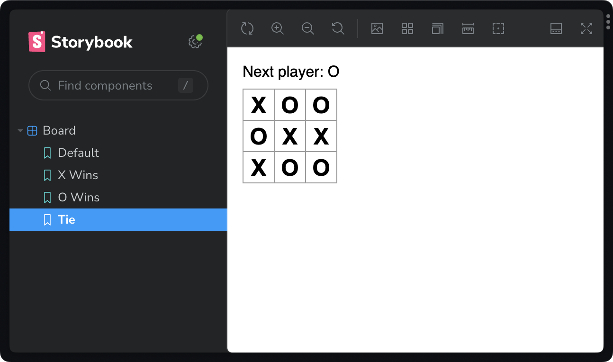
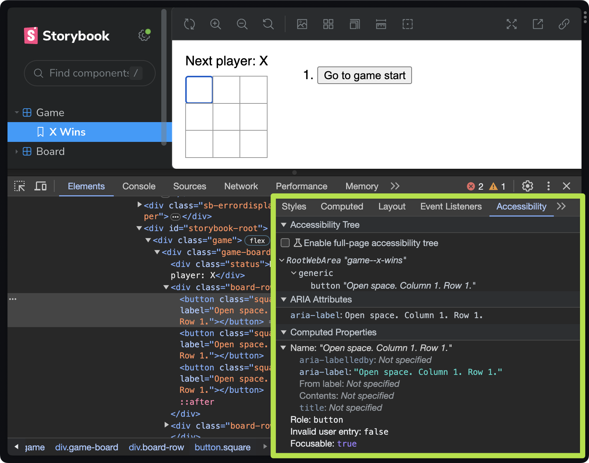
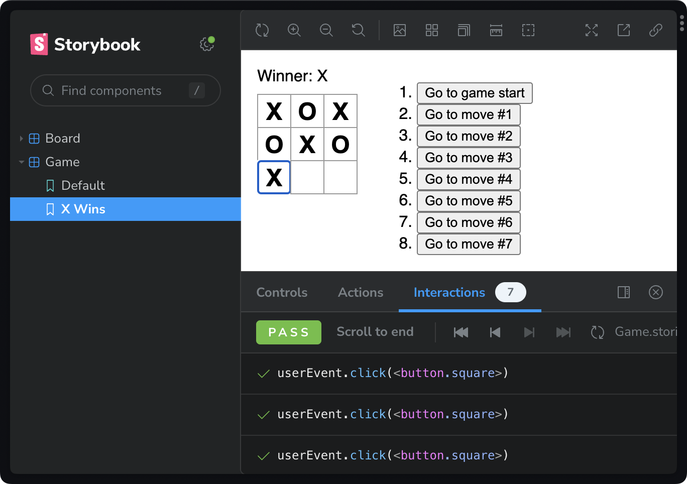
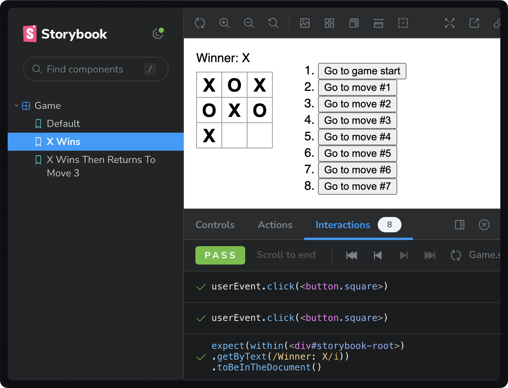

Testing is a critical component to providing reliable UI. But testing the wrong thing can actually _create_ bugs. And the type of bugs that might not even need fixing.

Let's look at why interaction testing (in the browser) provides the most value for effort, when testing UI.

:::hidden-script

[illustration] showing tests playing and stepping back over user events.

Let's dive in.

:::

## Contents

## Prerequisite: react.dev tic-tac-toe tutorial

Before we start, check out the [tic-tac-toe tutorial](https://react.dev/learn/tutorial-tic-tac-toe) over on the React docs.

:::hidden-script

[illustration] show react.dev/learn page. scanning over tutorial.
:::

We won't go thru that tutorial. But we will use its final component as a starting point.



## The wrong way to test UI

Let's start by testing this component _the wrong way_ — with unit tests.

When unit testing, _a normal inclination is to write tests that feel like writing code._ We'll see in a minute that this intuition is wrong.

Starting the, wrong way, I'd probably export the `Board` component (previously private in `App.tsx`).

```tsx title="App.tsx" ins=/export /
export function Board() {
  /* … */
}
```

I'd then build cases by appyling unique game scenarios to that component directly. (Represented below as [CSF](https://storybook.js.org/docs/react/api/csf) stories).

<!-- prettier-ignore -->
```tsx title="Board.stories.tsx"
import { Board } from "./App";

export default {
  component: Board,
};

export const Default = {};

export const XWins = {
  args: {
    squares: [ "X", "X", "X", null, null, null, null, null, null ],
  },
};
```

This isn't great.
It's not great because it violates two pretty important testing principles.

1. Private functions should be tested via public interfaces.
2. Test data should match real usage.

And look, we're out here _exporting private components_ to _test them with impossible states_.

Who smells a cheater?



:::hidden-script

[Visual] Use effect to show as list items.
:::

Let's fast-farward to a bit to see where where this practice becomes even more problematic. Look at this eventual case for a tie game:

```tsx title="Board.tsx"
export const Tie = {
  args: {
    squares: ["X", "O", "O", "O", "X", "X", "X", "O", "O"],
  },
};
```

It _looks_ reasonable.

But it results in an another impossible UI state where `O` is the next player — even though there are more `O`s on the board than `X`s. (Check my math.)



We may be inclined to fix this but _we would be fixing something a user would never experience_. This is a waste of time, effort, and complexity.

OK. Let's stop doing things the wrong way and start testing the right way.

## Interaction tests reveals a11y issues

Let's interact with the whole app using interactions (user events).

Start with a new story file, using [testing-library](https://testing-library.com).

```tsx title="Game.stories.tsx"
import Game from "./App";
import type { Meta, StoryObj } from "@storybook/react";
import { userEvent, within } from "@storybook/testing-library";

const meta = {
  component: Game,
} satisfies Meta<typeof Game>;

export default meta;

type Story = StoryObj<typeof meta>;

export const XWins = {
  // code here
} satisfies Story;
```

We immediately have a problem: we have no way to query the DOM for the squares.


[Testing-library](https://testing-library.com) applies _virtuous friction_ to our tests by forcing us to query the DOM _only_ by content that is available to assistive technologies. There is no way to directly query for `button.square`.

Because we've chosen to test like our user, we reveal a stark accessibility issue: all the board squares just read "Button."

Our testing pattern requires that we fix this issue before proceeding.

- Add a label to each square.
- Ensure that each square communicates both position and value.

```diff lang="tsx" title="App.tsx"
// Note: other implementation hidden

function Square({
  value,
+  index,
  onSquareClick,
}: {
  value: Square;
+  index: number;
  onSquareClick: () => void;
}) {
+  /*
+    Examples:
+      "Taken space. X. Column 1. Row 1."
+      "Taken space. O. Column 2. Row 1."
+      "Open space. Column 3. Row 1."
+  */
+  function label(index: number) {
+    return [
+      value ? `Taken space. ${value}.` : "Open space.",
+      `Column ${Math.floor(index % 3) + 1}.`,
+      `Row ${Math.floor(index / 3) + 1}.`,
+    ].join(" ").trim();
+  }

  return (
    <button
      className="square"
      onClick={onSquareClick}
+      aria-label={label(index)}
    >
      {value}
    </button>
  );
}
```

Now, we can navigate and query the DOM using content available to assistive technologies.



With a more accessible board, we can finally write tests.

## Test user events with Storybook interactions and play functions

In Storybook, we use interactions to create stories from user events.

Let's add the `XWins` story to `Game.stories.tsx` using a [play function](https://storybook.js.org/docs/react/writing-stories/play-function).

- Get all of the squares by their label (now containing the string `"space"`).
- Then simulate a game by awaiting `click` user events on each specific squares.

```diff lang="tsx" title="Game.stories.tsx"
// Note: story boilerplate in previous example

export const XWins = {
+  play: async ({ canvasElement }) => {
+    const canvas = within(canvasElement);
+    async function findByPosition(col: number, row: number) {
+      return await canvas.findByLabelText(
+        `Open space. Column ${col}. Row ${row}.`
+      );
+    }
+
+    await userEvent.click(await findByPosition(1, 1));
+    await userEvent.click(await findByPosition(2, 1));
+    await userEvent.click(await findByPosition(3, 1));
+    await userEvent.click(await findByPosition(1, 2));
+    await userEvent.click(await findByPosition(2, 2));
+    await userEvent.click(await findByPosition(3, 2));
+    await userEvent.click(await findByPosition(1, 3));
+  },
} satisfies Story;
```

Unlike our unit tests (above), this test simulates an actual game of tic-tac-toe.



## Make assertions with Jest

Up to this point, we've created visual tests (stories) but without codifying our expectations. Let's add tests using `jest`'s `expect` function.

- Import `expect` from `@storybook/jest`.
- Test that the game declares `X` a winner — after our interactions.

```diff lang="tsx" title="Game.stories.tsx"
import type { Meta, StoryObj } from "@storybook/react";
import Game from "./App";
import { userEvent, within } from "@storybook/testing-library";
+import { expect } from "@storybook/jest";

const meta = {
  component: Game,
} satisfies Meta<typeof Game>;

export default meta;

type Story = StoryObj<typeof meta>;

export const XWins = {
  play: async ({ canvasElement }) => {
    const canvas = within(canvasElement);
    async function findByPosition(col: number, row: number) {
      return await canvas.findByLabelText(
        `Open space. Column ${col}. Row ${row}.`
      );
    }

    await userEvent.click(await findByPosition(1, 1));
    await userEvent.click(await findByPosition(2, 1));
    await userEvent.click(await findByPosition(3, 1));
    await userEvent.click(await findByPosition(1, 2));
    await userEvent.click(await findByPosition(2, 2));
    await userEvent.click(await findByPosition(3, 2));
    await userEvent.click(await findByPosition(1, 3));
  },

+    await expect(canvas.getByText(/Winner: X/i)).toBeInTheDocument();
  },
} satisfies Story;
```

Open the Storybook interactions panel to see the expectations pass.



## Compose play functions for re-use

It would be a real hassle to re-create the `XWins` play function for every test. Instead, let's compose it into a new test as a prerequisite.

- Add a new `XWinsThenReturnsToMove3` story.
- Use `testing-library` to setup the canvas and elements.
- Call and await the `XWins.play` function (passing context).
- Await additional interactions and expectations.

```tsx title="Game.stories.tsx" /await XWins.*;/
export const XWinsThenReturnsToMove3 = {
  play: async (context) => {
    const canvas = within(context.canvasElement);
    const squares = canvas.getAllByLabelText(/space/i, {
      selector: "button",
    });
    const move3 = canvas.getByText(/Go to move #3/i);

    await XWins.play(context);

    await userEvent.click(move3);

    await expect(
      squares.filter((s) => s.textContent === "X").length
    ).toBe(2);
    await expect(
      squares.filter((s) => s.textContent === "O").length
    ).toBe(1);
    await expect(
      canvas.getByText(/Next player: O/i)
    ).toBeInTheDocument();
  },
} satisfies Story;
```

Our new `XWinsThenReturnsToMove3` runs the `XWins` play function and then plays the additional interactions and expectations.


_Note: In a JavaScript codebase, I would return an object with `{ canvas, squares }` from the play function. This reduces selector repetition when composing stories. But, in TypeScript, the `StoryObj<typeof { component: MyComponent }>` type dissalows return values. But I'm told this isn't strictly necessary and could change._

## What we learned

This was a long one but we covered a lot of ground.

We learned that unit tests are often the wrong way to test UI.
Not because unit tests are bad. But because they promote thinking like a developer, not a user. And you can't spell UI without U.

When practice interaction testing with testing-library, we can immediately see when UI is inaccessible. And we limit outcomes to user-producable states.

We learned how to capture tests as play functions. And how to compose play functions for re-use.

If you'd like to learn more about the mechanics of play functions in Storybook, check out [my video on the topic](https://youtu.be/dcuzwCHI940?si=xcHqymUaOc_at9xL).

## Prefer video?

Watch on YouTube!

<div data-responsive-youtube-container>

https://youtu.be/Waht9qq7AoA?si=FKG9xVluuOqVpdF9

</div>
