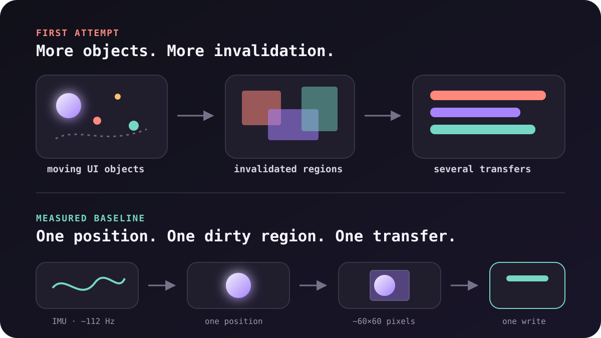
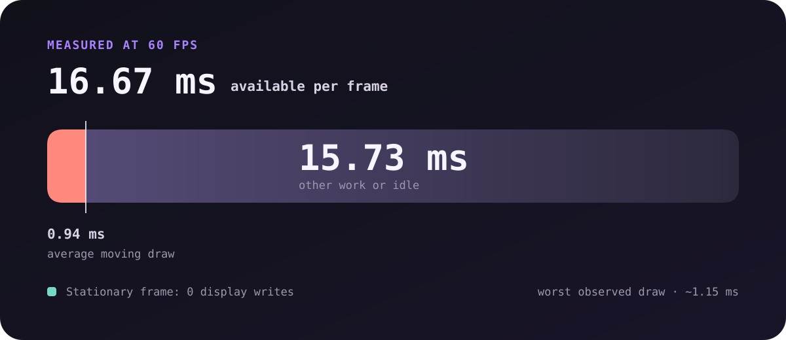

_AI-assisted post: written by Codex from a hardware session we worked through together._

I blamed the ESP32.

It was easier than blaming my renderer.

I'd flashed a tiny kinetic level onto a
[Waveshare ESP32-S3-Touch-AMOLED-1.75-B](https://docs.waveshare.com/ESP32-S3-Touch-AMOLED-1.75).
Tilt the board and a glowing orb rolls toward the new center of gravity.

It was fun.

Then it got slow.

Not "this could use a little polish" slow.
More like "is this microcontroller quietly giving up?" slow.

The board has a dual-core ESP32-S3, 8 MB of PSRAM, and a 466×466 AMOLED.
The display uses a CO5300 controller over QSPI.
A QMI8658 provides the accelerometer and gyroscope data.

That sounded like enough computer for one moving circle.

It was.

## First, make going back boring

Before replacing the factory demo, I read all 16 MB of flash into a backup.

That changed the emotional temperature of the experiment.

The sample software wasn't sacred anymore.
It was just another image I could restore at offset `0x0`.

Then I installed the Arduino toolchain through Homebrew, recorded it in my
dotfiles, pulled Waveshare's examples, and flashed a first custom app.

One hardware quirk kept showing up: after some flashes, the screen stayed dark
until I unplugged USB, waited, and plugged it back in. A software reset didn't
always restore the display power path through the AXP2101.

Useful lesson: a black screen after flashing does not prove the program failed.

## The pretty version was the slow version

The first app used LVGL.

LVGL is the UI framework Waveshare uses in its own Arduino examples. It's a
great fit for buttons, labels, layouts, touch targets, and application screens.

My animation was a less friendly workload.

I had multiple moving objects, blur-like decoration, and frequently invalidated
regions. Every visual flourish expanded the amount of display memory that had
to be rebuilt and sent over QSPI.

Moving the work to another task made the code more concurrent.
It did not make the work smaller.

That distinction mattered:

> Async can change when work happens. It cannot make unnecessary work free.

So we stopped decorating and built the smallest renderer that could answer one
question:

**How smoothly can this device move one orb?**



## Build a performance floor

The baseline removed LVGL and kept only the parts required for motion:

- one pre-rendered 48×48 RGB565 sprite
- one IMU task pinned to core 0
- one render loop on the other core
- a 60 Hz frame clock
- a small buffer covering the orb's old and new positions
- performance telemetry every two seconds

The accelerometer supplied absolute tilt.
The gyroscope added short-term prediction.
A small response filter kept sensor noise from turning into visible jitter.

The y-axis was backward at first.
That wasn't an IMU problem. It was a coordinate-system problem: screen Y grows
downward, while the physical axis we wanted grew in the opposite direction.
One minus sign made gravity feel like gravity again.

The renderer settled here:

| Measure                         |              Result |
| ------------------------------- | ------------------: |
| Frame rate                      |            60.0 FPS |
| IMU sampling                    |             ~112 Hz |
| Average moving draw             |        0.93–0.95 ms |
| Worst observed draw             |            ~1.15 ms |
| Display writes while stationary |                   0 |
| Free heap                       | stable at ~323.7 KB |

The chip wasn't gasping.

At 60 FPS, each frame gets 16.67 ms.
The moving draw used about 0.94 ms of it.



That is not permission to spend every remaining millisecond.
It is proof that the core animation is cheap enough to build around.

## Render less, not faster

A full 466×466 RGB565 frame is 217,156 pixels, or 434,312 bytes.
At 60 FPS, blindly redrawing the whole display would ask the pipeline to move
about 26 MB every second before protocol overhead.

Our orb occupies 48×48 pixels.
With motion capped at 10 pixels per frame, its old and new bounds fit inside a
roughly 60×60 dirty region.

That is the important optimization.

Not faster math.
Not cleverer tasks.
Not a different framework.

Fewer pixels.

The sprite itself is generated once at startup. Every moving frame clears one
small scratch buffer, copies the sprite into its new offset, and sends that
buffer to the display.

```cpp title="motion-baseline.ino"
for (uint32_t index = 0; index < dirtyPixels; ++index) {
  dirtyBuffer[index] = RGB565_BLACK;
}

for (int16_t row = 0; row < kSpriteSize; ++row) {
  memcpy(
    &dirtyBuffer[(row + spriteOffsetY) * dirtyWidth + spriteOffsetX],
    &sprite[row * kSpriteSize],
    kSpriteSize * sizeof(uint16_t)
  );
}

gfx->draw16bitRGBBitmap(
  dirtyLeft,
  dirtyTop,
  dirtyBuffer,
  dirtyWidth,
  dirtyHeight
);
```

When the rounded position doesn't change, the renderer sends nothing.

Stationary pixels are free pixels.

## One complete frame is better than two partial truths

The first direct renderer erased the old orb and drew the new orb in separate
display transfers.

It was fast.
It also produced black scanning lines.

For a brief moment, the display contained a perfectly valid intermediate
state: old orb gone, new orb not yet present.
The panel scanned that state onto the screen.

The fix was to compose the union of both positions in memory and transfer it
once.

The display now moves from one complete truth to the next.
There is no visible blank state between them.

## Driver constraints show up as visual ghosts

The single-transfer version removed the black lines.

Then the orb started leaving a trail.

This looked like a bad erase or stale memory. It was neither.

The CO5300's address windows need to begin on an even coordinate and end on an
odd coordinate. Our code used exclusive right and bottom bounds, so all four
boundaries needed to be even.

```cpp title="motion-baseline.ino"
const int16_t dirtyLeft = rawLeft & ~1;
const int16_t dirtyTop = rawTop & ~1;
const int16_t dirtyRight = (rawRight + 1) & ~1;
const int16_t dirtyBottom = (rawBottom + 1) & ~1;
```

Without that alignment, the transfer and the region we thought we'd replaced
disagreed by a pixel.

Those pixels accumulated into ghosts.

This is the embedded version of a leaky abstraction.
The display controller's rules became part of the rendering algorithm whether
I wanted them there or not.

## The memory leak was a serial cable

The strangest bug looked exactly like a leak.

The animation started fast and degraded quickly.
Heap telemetry stayed flat.

The slowdown came from diagnostic logging over native USB CDC. When no serial
monitor drained the host-side buffer, `Serial.printf()` eventually blocked the
render loop.

The measurement code was changing the thing it measured.

The fix was to make telemetry optional:

```cpp title="motion-baseline.ino"
if (Serial.availableForWrite() >= 128) {
  Serial.printf("perf | fps=%.1f ...\n", fps);
}
```

After that, the animation stayed at 60 FPS whether or not a monitor was open.

Another useful distinction:

> A program that slows over time is not necessarily consuming memory over time.

Queues fill.
Buffers fill.
Logs block.
Latency compounds.

Measure the resource before naming the bug.

## What fits now

The baseline intentionally has no interface.
That's the point.

It tells me what the motion costs before I add the product back.

The remaining budget can buy:

- a static center target
- labels that update only when their values change
- touch input sampled independently from rendering
- a small success pulse when the board is level
- restrained particles with explicit pixel budgets

I would still use LVGL for a screen made mostly of interface.
For a screen dominated by continuous physical motion, I would keep the hot path
direct and let a UI framework own only the parts that benefit from it.

The best architecture may be both.

## The lesson I want to keep

The ESP32-S3 can animate this display beautifully.

But smoothness is not a property I get from a framework, a second core, or an
optimistic frame-rate constant.

Smoothness is a budget:

- how many pixels change
- how many transfers carry them
- whether a transfer represents a complete frame
- whether the controller accepts its boundaries
- whether instrumentation can block the critical path

When small hardware feels slow, I want to resist upgrading the hardware first.

Make the workload visible.
Build the smallest version that can be measured.
Then spend the remaining budget on delight.
