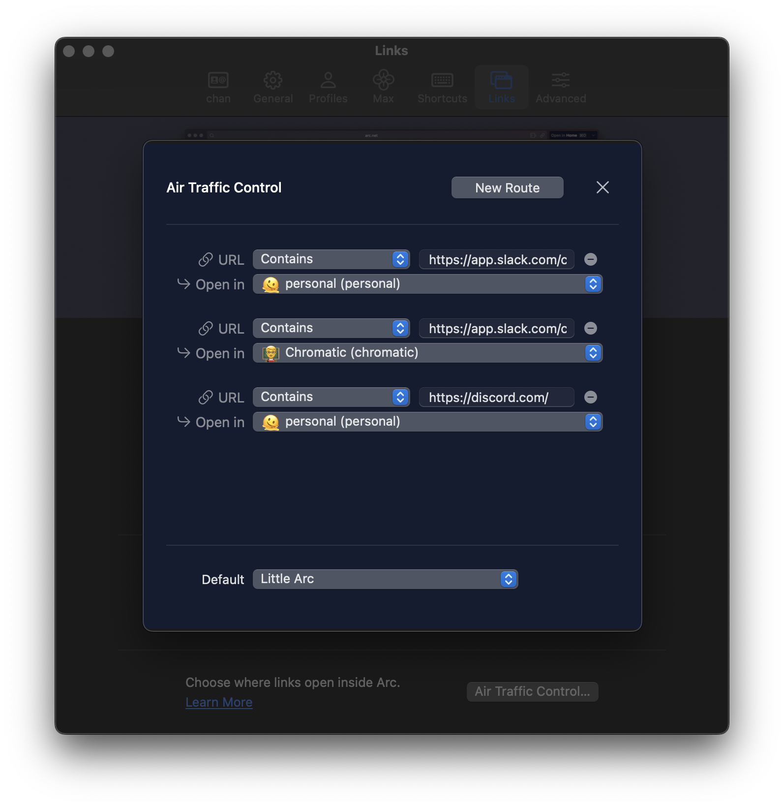

## Context

I've only really been using Raycast for 2 weeks.
But I used it as a calendar event launcher for years. lol

## Calendar

- Next event hoisting
- [Create Quick Event](https://www.raycast.com/mblode/quick-event/commands)

## Quicklinks

As a launcher, I love that you can use it for launching web apps.

- [Lose It!](https://www.loseit.com/)
- [DIM](https://app.destinyitemmanager.com/4611686018501985403/d2/inventory)

This is great for getting out of that cycle where you get used to typing part of a domain in a search bar. But then you visit another domain with a similar name, and that starts getting prioritized. Quicklink for anything I go to a lot.

And I can also set the exact page I want.

I launch all my electron apps into the web browser.

- [Discord](https://discord.com/channels/@me)

And when working with Arc (Browser), we can use [Air Traffic Control](https://resources.arc.net/hc/en-us/articles/19228064149143-Spaces-Distinct-Browsing-Areas#howtosetuparoute) to open the correct spaces and profiles:

- `Slack | personal`
- `Slack | chromatic` (opens in my chromatic space and profile)

Now something I love about Raycast is how easy and discoverable everything is to manage with keyboard shortcuts.

Like, Chromatic just laid off it's OSS DX team. So, I can delete this one 😅

<kbd>⌘ k</kbd>
<kbd>^ x</kbd>

### VS Code workspaces

- .dotfiles
- chan.dev
- chan.dev/content

- netlify/deploys

LOVE that it's so easy to duplicate a command from the keyboard.

"Open with…" option

## Snippets

I use snippets for structured text formats.
I don't have much going on but I use for expense reports a lot — where a specific format is required.

- `wellness stipend` (uses new variables)

Auto-expanding snippets.

- `@@`

##

Egghead snippet to add affiliate link.

## Emoji

- [Unregister emoji shortcut](https://www.reddit.com/r/MacOS/comments/15j3pza/comment/juxx8ib/?utm_source=share&utm_medium=web3x&utm_name=web3xcss&utm_term=1&utm_content=share_button). Absolutely chaotic that this has to be done.
- Love that you can grab the unicode character.

## Other

- [Navigator/Menu Item Search](https://www.raycast.com/changelog/1-20-0).
- Download video.
- `mdn` + tab `{search_term}`
- Change Display Mode. For changing my main display from 5k to 4k (recording).
- clipboard history
- open camera

## Some ideas

- Create a new extension for getting a VS Code url for a file path. Can this be a service? That would be dope. Maybe it's a Shortcut or script.
- Create extension for selecting an HTML hyperlinks. Then converting them to markdown (as a service).

## Improvements

- Magnet style window drag zones. I'd be able to stop using Magnet.
- I'd love more markdown hints
- There's this app that I've always wanted to build for podcast or lecture notetaking that has a timer and commits comments to times. I'd love to see that as a floaty note variant.
