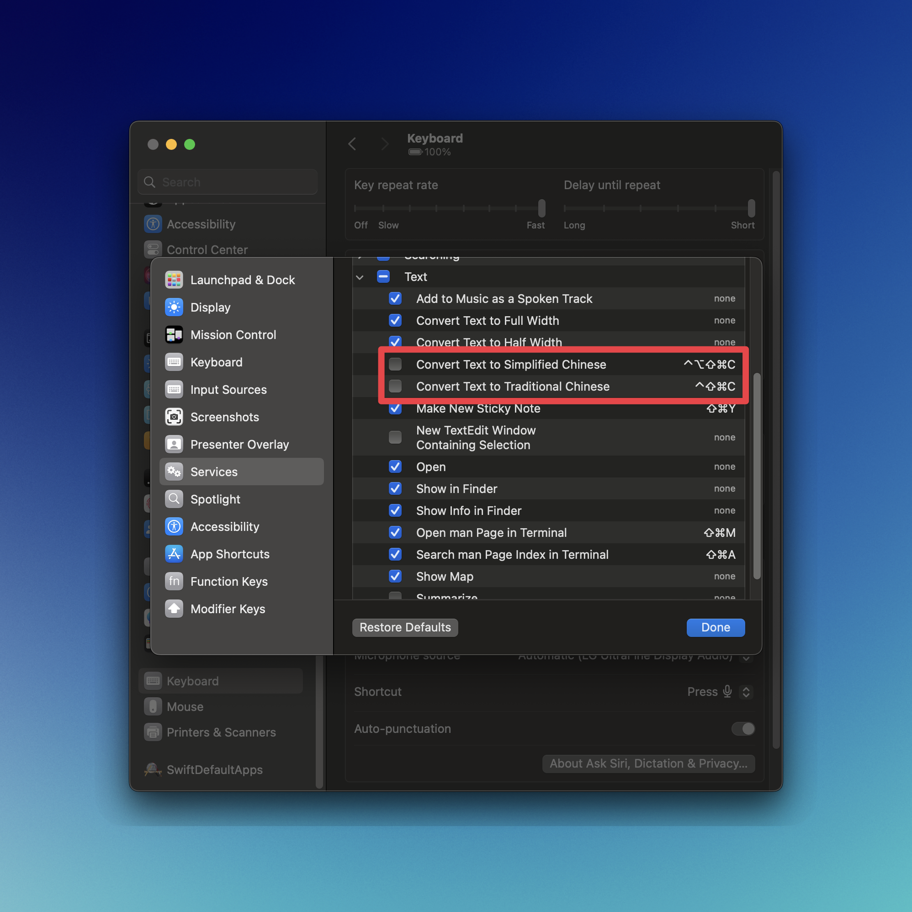

<iframe width="560" height="315" src="https://www.youtube.com/embed/OHuLnaY7Nxs?si=FWtqniJQaFRdyQy3" title="YouTube video player" frameborder="0" allow="accelerometer; autoplay; clipboard-write; encrypted-media; gyroscope; picture-in-picture; web-share" referrerpolicy="strict-origin-when-cross-origin" allowfullscreen></iframe>

## Context

I've only really been using Raycast for 2 weeks.
But I used it as a calendar event launcher for years. lol

## Calendar

- Next event hoisting
- [Create Quick Event](https://www.raycast.com/mblode/quick-event/commands)

## Quicklinks

As a launcher, I love that you can use it for launching web apps.

- [Lose It!](https://www.loseit.com/)
- [DIM](https://app.destinyitemmanager.com/4611686018501985403/d2/inventory)

This is great for getting out of that cycle where you get used to typing part of a domain in a search bar. But then you visit another domain with a similar name, and that starts getting prioritized. Quicklink for anything I go to a lot.

And I can also set the exact page I want.

I launch all my electron apps into the web browser.

- [Discord](https://discord.com/channels/@me)

And when working with Arc (Browser), we can use [Air Traffic Control](https://resources.arc.net/hc/en-us/articles/19228064149143-Spaces-Distinct-Browsing-Areas#howtosetuparoute) to open the correct spaces and profiles:

- `Slack | personal`
- `Slack | chromatic` (opens in my chromatic space and profile)

Now something I love about Raycast is how easy and discoverable everything is to manage with keyboard shortcuts.

Like, Chromatic just laid off it's OSS DX team. So, I can delete this one 😅

<kbd>⌘ k</kbd>
<kbd>^ x</kbd>

### VS Code workspaces

- .dotfiles
- chan.dev
- chan.dev/content

- netlify/deploys

LOVE that it's so easy to duplicate a command from the keyboard.

"Open with…" option

## Snippets

I use snippets for structured text formats.
I don't have much going on but I use for expense reports a lot — where a specific format is required.

- `wellness stipend` (uses new variables)

Auto-expanding snippets.

- `@@`

##

Egghead snippet to add affiliate link.

## Emoji

- [Unregister emoji shortcut](https://www.reddit.com/r/MacOS/comments/15j3pza/comment/juxx8ib/?utm_source=share&utm_medium=web3x&utm_name=web3xcss&utm_term=1&utm_content=share_button). Absolutely chaotic that this has to be done.
- Love that you can grab the unicode character.

## Other

- [Navigator/Menu Item Search](https://www.raycast.com/changelog/1-20-0).
- Download video.
- `mdn` + tab `{search_term}`
- Change Display Mode. For changing my main display from 5k to 4k (recording).
- clipboard history
- open camera

## Some ideas

- Create a new extension for getting a VS Code url for a file path. Can this be a service? That would be dope. Maybe it's a Shortcut or script.
- Create extension for selecting an HTML hyperlinks. Then converting them to markdown (as a service).

## Improvements

- Magnet style window drag zones. I'd be able to stop using Magnet.
- I'd love more markdown hints
- There's this app that I've always wanted to build for podcast or lecture notetaking that has a timer and commits comments to times. I'd love to see that as a floaty note variant.

## Raw notes

**(These are just notes. I'd like this to be a guide)**

## Commands

<kbd>⌥</kbd> + <kbd>Space</kbd> - Open Raycast
<kbd>⌘</kbd> + <kbd>K</kbd> - List options for command

### Basics

1. <kbd>ESC</kbd> navigate back one page
1. <kbd>⌘ ESC</kbd> navigate back to main page
1. <kbd>⌘ W</kbd> open preferences
1. <kbd>⌘ ,</kbd> open preferences

## Beginner features to adopt

<iframe width="560" height="315" src="https://www.youtube.com/embed/LyacFwVDr8o?si=bXTRJWsfoeBoNd03" title="YouTube video player" frameborder="0" allow="accelerometer; autoplay; clipboard-write; encrypted-media; gyroscope; picture-in-picture; web-share" allowfullscreen></iframe>

## Tip: alias

Typing the alias, followed by a space, directly opens a Command, saving you an extra step

## Workflows to demo in "what's in my Raycast"

Theme: reducing friction for every day things. #lube

- Calendar
- Quick link for most opened VS Code projects
  - Create
  - Duplicate
- Using quick links in tandem with Arc Flight Control to launch in-browser apps (in different profiles even)
- Ergonomic emoji selection (`tab`)
  - Replace default keyboard shortcut
  - [Unregistering the emoji keyboard on mac](https://www.reddit.com/r/MacOS/comments/15j3pza/comment/juxx8ib/?utm_source=share&utm_medium=web3x&utm_name=web3xcss&utm_term=1&utm_content=share_button)
- Expense formatting with snippets
- multi-clipboard history

## 2024-01-20

- Create a new extension for getting a VS Code url for a file path. Can this be a service? That would be dope. Maybe it's a Shortcut or script.

## 2024-01-16

- [Create Quick Event](https://www.raycast.com/mblode/quick-event/commands). I Really like the native Quick Event environment. This simply brings it into Raycast
- [Navigator/Menu Item Search](https://www.raycast.com/changelog/1-20-0). I use help search all of the time. This makes it one less thing I need a mouse for.

## 2024-01-28

Unregister these commands to utilize <kbd>hyper + c</kbd>

- System Settings > Keyboard > Shortcuts > Services > Text > - Convert Text to Simplified Chinese - Convert Text to Traditional Chinese
  

Deciding to use Raycast to track application opening/switching shortcuts.

(intereset that this also works as cmd if i'm alread in the app i intend to switch to)

- a
- b - browser, Arc
- c - calendar, Calendar
- d
- e - editor, VS Code
- f - finder, Finder
- g
- h
- i
- j
- k
- l
- m - messenger, Messages
- n - notes, Obsidian
- o
- p
- q
- r
- s
- t - terminal, Warp
- u
- v
- w
- x
- y
- z

- ← - move window to left half of screen (rotates between 1/2, 2/3, 1/3 when repeated)
- → - move window to right half of screen (rotates between 1/2, 2/3, 1/3 when repeated)

## Found notes for snippet creation

### Basics

To use snippets, you gotta create them first.

- Call up the `Create snippet` command
- Hit `enter` to open the command
- Give it a unique name
  - Spaces are ok
- Paste your snippet in
- And that's all that's required.

### Placeholders

- In this box you can change rich text formatting, add links, whatever
  - I don't personally care about that
- But to the right you can add `placeholders`
  - Click this `+` button to make your snippets dynamic
- Add a date, with one of the pre-selected options
  - Or use a custom date
- We can then place the cursor too!
  - Hit `+` again, and place this where you'd like to place the cursore
- You can also automatically include whatever's in your pasteboard

### Keyboard triggers

Keyboard triggers are great if you don't want to touch Raycast at all…

## Use Snippet

## Import Snippet

- https://manual.raycast.com/snippets/how-to-import-snippets
- It will avoid including duplicates, which means you can set up a snippets file, and re-import that every time you make changes
  - Just note that any time you change a name, that's going to
