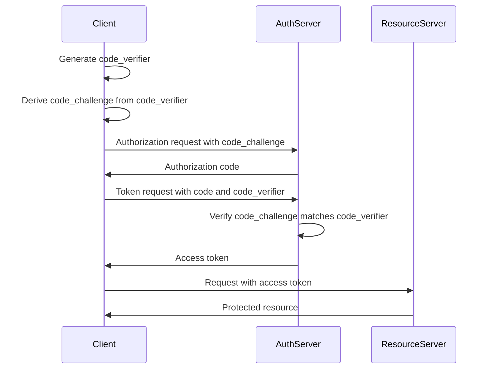

<p class="bg-yellow-100 p-6 text-yellow-800 border-yellow-800 border-0 border-l-4" data-astro-source-file="/Users/chan/sites/chan.dev/src/components/post.astro" data-astro-source-loc="36:85">
🚧 This post is written via prompt, using Claude 3.5 Sonnet. It was completeed as a baseline for comparison in a hiring process.
</p>

OAuth 2.0's authorization code flow, while robust, faces challenges when implemented in public clients. For example, in a mobile app, malicious software can intercept the authorization code, allowing an attacker to impersonate the user and gain unauthorized access to their account.

PKCE (Proof Key for Code Exchange) is a security extension designed to address these vulnerabilities. PKCE enhances the security of the authorization code flow by creating a cryptographically random key for each authorization request, effectively preventing the interception and misuse of authorization codes.

Think of PKCE as a dynamic lock-and-key system for your OAuth flow. For each request, you create a unique key (code verifier) and a matching lock (code challenge). Only the client with the original key can unlock the access token, ensuring that even if an attacker intercepts the authorization code, they can't use it without the corresponding key.

WorkOS now supports PKCE, making it easier than ever to implement this enhanced security measure in your applications, particularly for native apps and single-page applications.

For a more in-depth explanation of PKCE and its implementation, check out this comprehensive article on [OAuth.com](https://oauth.com/oauth2-servers/pkce/).

## PKCE in Context: Comparing Authentication Strategies

| Method                                                                                   | Security Level | Complexity | Best Use Case                            |
| ---------------------------------------------------------------------------------------- | -------------- | ---------- | ---------------------------------------- |
| [PKCE](https://oauth.com/oauth2-servers/pkce/)                                           | High           | Medium     | Public clients, mobile apps, SPAs        |
| [Implicit Flow](https://oauth.com/oauth2-servers/oauth2-clients/mobile-and-native-apps/) | Low            | Low        | Deprecated, avoid in new implementations |
| [Client Secret](https://oauth.com/oauth2-servers/client-registration/client-id-secret/)  | High           | Low        | Confidential clients (secure backends)   |

PKCE is the preferred method for public clients because it provides a high level of security without requiring a client secret, which can't be safely stored in public clients. It effectively mitigates the risk of authorization code interception, making it ideal for mobile apps and single-page applications where the implicit flow was previously used.

The Implicit Flow, while simpler, is now considered less secure and is no longer recommended for most use cases. It was originally designed to reduce complexity for public clients, but the security trade-offs have led to its deprecation in favor of more secure methods like PKCE.

The Client Secret method remains highly secure but is only suitable for confidential clients that can securely store the secret, such as server-side applications. For public clients, PKCE offers a comparable level of security without the need for a client secret.

## Visualizing the PKCE Flow

Before we dive into the implementation, let's visualize how PKCE augments the standard OAuth flow with an additional layer of verification, ensuring that only the original client can exchange the authorization code for tokens.



This diagram illustrates the step-by-step process of the PKCE flow, highlighting how the code verifier and code challenge work together to enhance security.

Implementing PKCE: A Step-by-Step Guide

1. Generate the Code Verifier and Challenge
   Let's create our cryptographic "key" (the code verifier) and its corresponding "lock" (the code challenge). This process ensures each authorization request has a unique, secure identifier.

```python
import os
import hashlib
from base64 import urlsafe_b64encode

code_verifier = os.urandom(64).encode('base64')
```

code_challenge = urlsafe_b64encode(hashlib.sha256(code_verifier).hexdigest()) 2. Initiate the Authorization Request
Now, construct the authorization URL. We'll include the PKCE parameters to ensure our request is secure from the start.

```python
import workos
from workos import client

workos.api_key = "sk_example_123456789"
workos.client_id = "client_123456789"

authorization_url = client.user_management.get_authorization_url(
    connection_id="conn_01E4ZCR3C56J083X43JQXF3JK5",
    redirect_uri="https://your-app.com/callback",
    state="dj1kUXc0dzlXZ1hjUQ==",
    code_challenge=code_challenge
)
```

## 3. Exchange the Authorization Code for Tokens

Finally, authenticate using the authorization code we received and our original code verifier. This step completes the PKCE flow, securely obtaining the access token.

```python
user_and_organization = client.user_management.authenticate_with_code(
    code="01E2RJ4C05B52KKZ8FSRDAP23J",
    code_verifier=code_verifier
)
```

## 4. Handle Errors

When implementing PKCE, it's crucial to handle potential errors gracefully. Here's an example of how you might add error handling to the authentication step:

```python
- try:
    user_and_organization = client.user_management.authenticate_with_code(
        code="01E2RJ4C05B52KKZ8FSRDAP23J",
        code_verifier=code_verifier
    )
+except workos.WorkOSException as e:
+    print(f"Authentication failed: {str(e)}")
+    # Handle the error appropriately (e.g., log it, notify the user, retry)

```

## Implementation in Other Languages

While this guide uses Python for examples, the principles of PKCE apply across all programming languages. WorkOS provides SDKs for various languages to make implementation easier. Check out the WorkOS SDK documentation for language-specific guides and examples.

## Conclusion

PKCE significantly enhances OAuth 2.0 security for public clients, balancing strong protection with ease of implementation. By integrating PKCE into your authentication process, you provide users with a more secure experience while safeguarding against common vulnerabilities.
Ready to strengthen your application's authentication? Sign up for a WorkOS account and start implementing PKCE in your OAuth flow today
