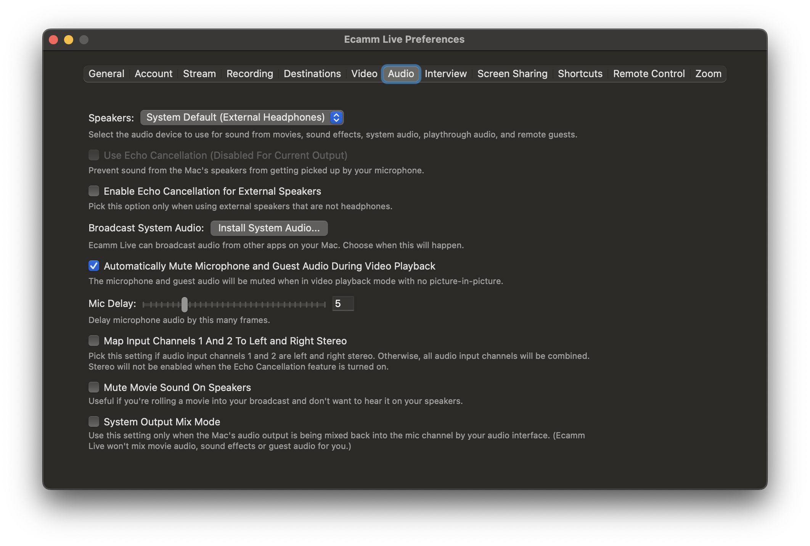
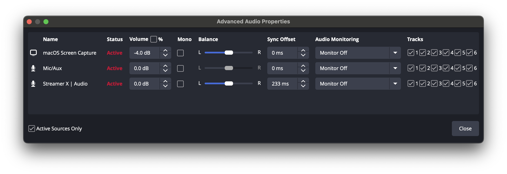

## Why I like this camera

## Output lag and compensation

The S5II\* suffers very bad output lag.

Lag improves when HDMI audio is disabled.
But at it's worst, video trails audio by 5-7 frames (on an average audio interface).

And it get's wierd…
Using the same hardware (with different software) requires slightly different offsets.

These offsets work for me, with both camera and microphone going thru RodeX Streamer X.

| Software   | Feature name | Offset                   |
| ---------- | ------------ | ------------------------ |
| Ecamm Live | Mic Delay    | +5 frames (167ms @30fps) |
| OBS        | Sync offset  | +7 frames (233ms @30fps) |

([Handy frame:offset calc](https://calculator.academy/frames-to-ms-calculator/).)

