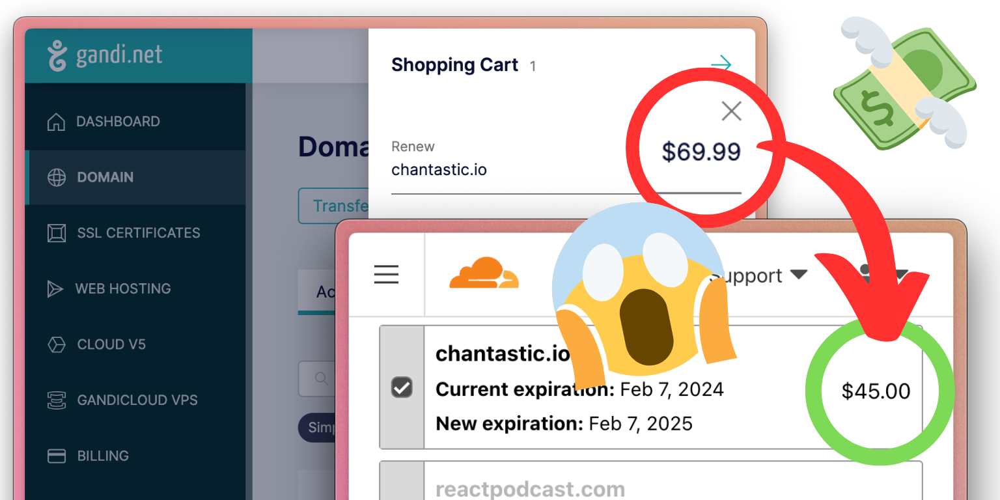

This was fun!
I'd never used Intersection Observer and now I have 10 different places I want to use it.

## Contents

---

## Exercise 1: Intersection Observer video

Kicking off a research project, I ask for `#lazyweb` help [on X](https://x.com/chantastic/status/1743339523164291092?s=2) and [Bluesky](https://bsky.app/profile/chantastic.bsky.social/post/3kiawcdqs5b2c). I then [collect what I learn into a draft post](https://chan.dev/intersection-observer/), and stream my first impressions.

<iframe width="560" height="315" src="https://www.youtube.com/embed/Yqs2kLM59m8?si=QIcbyCDxfHi_5QAV" title="YouTube video player" frameborder="0" allow="accelerometer; autoplay; clipboard-write; encrypted-media; gyroscope; picture-in-picture; web-share" allowfullscreen></iframe>

So I ran with two ideas, using formats I knew I could execute in an hour.

- No thumbnail.
- Short-form, to keep a focused script.

My first (and better one) crashed. _More talk about that later._

<iframe
  width="310"
  height="580"
  src="https://www.youtube.com/embed/plpIIZP8olg"
  title="YouTube video player"
  frameborder="0"
  allow="accelerometer; autoplay; clipboard-write; encrypted-media; gyroscope; picture-in-picture; web-share"
  allowfullscreen></iframe>

<!-- Cross-posted to [X](https://x.com/chantastic/status/1749427512554500241?s=20), [YouTube](https://youtube.com/shorts/plpIIZP8olg?feature=share), [TikTok](https://www.tiktok.com/t/ZT8sAXhPD/) (baby's first), [Instagram](https://www.instagram.com/reel/C2Z_haeLFNS/?igsh=ZDE1MWVjZGVmZQ==), [Facebook](https://www.facebook.com/reel/1297258147581746), [threads](https://www.threads.net/@chantastic/post/C2aAK0Kh24C), [mastodon](https://hachyderm.io/@chantastic/111800135977533111), and [LinkedIn](https://www.linkedin.com/posts/chantastic_coding-javascript-visualize-activity-7155212155850510336-PMjW?utm_source=share&utm_medium=member_desktop). -->

### Tools used:

- [Ecamm Live](https://chan.dev/ecamm) for streaming.
- [VideoTap](https://chan.dev/videotap) for post-processing stream.
  - Chapter markers.
  - Transcript (`.srt`).
  - Clip identification.
- [OpenAI Whisper](https://github.com/openai/whisper) for high-quality short form transcript.
- `#lazyweb`/community.

---

## What went wrong?

The video I had in mind from the start was "This JS 1-liner adds infinite scroll to any feed!". You can see the Stackblitz kitten demo here:

https://stackblitz.com/edit/web-platform-92m6bu?embed=1&file=script.js

Unfurtunately, it was a new format (for me), it didn't flow, and I accidentally recorded in HDR (which looked terrible no matter what I did.)

But I'm gonna give it another try because I think the hook was good.

<!-- 

Things I learned from trying…

- I was a little shouty.
- Zander's super clean, soft-lit, white studio makes a much classier backdrop than mine.
- Recurring phrases are hypnotic and an important aspect of this format.
- Accidentally recording with HDR on is a real nightmare in DaVinci Resolve. lol
- I needed a deskable tripod to pull this well. I was holding it on my mic stand to type at the same time.

 -->

---

## Exercise 2: video proposals

<!-- 

Exercise brief…

> Put together a brief outline of two (2) topics you would hypothetically want to pursue for educational content under the Syntax brand.
>
> Each topic should have a 1-3 sentence description, a few bullet points explaining who the video is for, what value the audience will get, why you think it’s a good candidate topic, etc.
>
> The goal is for us to get a sense of what you’re interested in, and gauge your ability to ideate and create a plan.

 -->

### 1. Drizzle ORM

Drizzle is the TS-minimimalist's ORM.  
If you want type saftey and like getting your hands dirty in SQL, Drizzle it is.

#### Title options

| Volume     | Description                                       | Vibe        |
| ---------- | ------------------------------------------------- | ----------- |
| 🌶️ Spicy   | **Is Drizzle raining on ORMs??**                  | Urgency     |
| 🍚 Mild    | **FINALLY, type-safe SQL!**                       | Relief      |
| 🍚 Mild    | **Why Drizzle is my new famorite TypeScript ORM** | Enthusiasm  |
| 🥱 Literal | **Drizzle ORM: A tutorial on type-safe SQL**      | Informative |

**Audience:**
: Intermediate+ full-stack developers with an insatiable appetite for type safety.

**Value/Viewer outcome:**

- Experience Drizzle's minimalist design.
- Behold type-safe SQL (and autocomplete).
- Learn the Drizzle's distinguishing term for legacy ORMs: _"data frameworks"_. Bonus, ruin cocktail parties for a month.

#### Why I like it

Drizzle has legs in the type-safe ORM discussion. I love the strong opinion for a transparent API. "Learn Drizzle, get better at SQL." It's a fun conversation to take part in while the TypeScript ecosystem is seeing more viable alternatives.

Inspiration:

> ORM stands for object-relational mapping, and developers tend to call Django-like or Spring-like tools an ORM. We truly believe it’s a misconception based on legacy nomenclature and we call them data frameworks.
>
> With data frameworks you have to build projects around them and not with them.
>
> Drizzle lets you build your project the way you want, without interfering with your project or structure.
>
> Using Drizzle you can define & manage database schemas in TypeScript, access your data in a SQL-like or relational way, and take advantage of opt-in tools to push your developer experience through the roof 🤯

— _[Headleas ORM?](https://orm.drizzle.team/docs/overview#headless-orm) doc_

#### Take it further

If this did well in short form, I'd pitch a longer-form video on the topic:

- _Drizzle ORM: A Crash Course in Type-Safe SQL_
- _Drizzle or Rain? What every ORM may get wrong…_
- _TypeScript ORM Battle: Drizzle vs Prisma_

---

### Topic 2: Don't overpay for domains

This is a little riff on the [5 Sick Domain Registrars short, by Scott](https://www.youtube.com/shorts/pQLBAlHzIGc). It adds a splash of urgency, #new-year-new-you, and personal failing.

#### Title options

| Volume   | Description                                                                      | Vibe        |
| -------- | -------------------------------------------------------------------------------- | ----------- |
| 🌶️ Spicy | **Inflation is coming for your Domain Names. And here's how you can stop it 🛑** | Urgency     |
| 🌶️ Spicy | **Half-price domain names on this registrar…**                                   | Urgency     |
| 🍚 Mild  | **How to avoid paying more for domain names in 2024**                            | Informative |
| 🍚 Mild  | **HOW MUCH was that Domain Name‽**                                               | Indignance  |

**Audience:**
: Web developers with a zest for artisanal TLDs, and a disdain for inflation.

**Value/Viewer outcome:**

- Learn that registration fees are going up.
- Discover Cloudflare's "at-cost" registration and renewal.
- Protect their avo toast lifestyle.
- Judge me for my war-chest of parked domains.

#### Why I like it

Being a "domain name collector" is something I love about the web developer persona. It's a playful celebration of our unique brand of nerd.

#### Take it further

If this did well in short form, I'd pitch a segment asking famous developers what their most expensive and most ridiculous recurring domain purchases are.

1. _What's in a (domain) name?_
2. _You paid HOW MUCH for that domain?_

In researching this, I came across the _domain name generator_ category of products. Making a humorous video from this listicle could be fun :)

## Notes

As I conducted research, [I kept all of my notes here](http://localhost:2426/intersection-observer). It's a good asset for future shorts, medium length explainer video, or even a short course!
