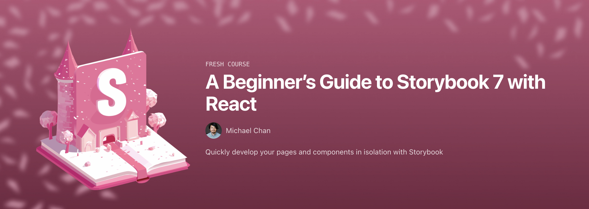

Hey **Syntax. &times; Sentry** 👋

"Show. Don't tell."

I tried to write a cover letter, to **tell** you why I fit for your video role. But it felt weird not to _show_ you.

So, in addition to my [LinkedIn CV](https://www.linkedin.com/in/chantastic/), please accept this "cover video" and list of recent projects.

Talk soon.  
Chan

	<iframe
		width="560"
		height="315"
		src="https://www.youtube.com/embed/ElkigVweIzA?si=i0WCJEGUe9dejtwr"
		title="YouTube video player"
		frameborder="0"
		allow="accelerometer; autoplay; clipboard-write; encrypted-media; gyroscope; picture-in-picture; web-share"
		allowfullscreen></iframe>

<article>

## Storybook Video Education

For two years, I've developed Storybook's approach to video education. Most of that work is found on [the Chromatic YouTube channel](https://www.youtube.com/@chromaticui).

We have a very small team. So I'm most proud of the framework I use to distribute multi-modal content quickly. With one script, I create a blog post, X thread, shorts, and a video (which integrated back into [the docs](https://storybook.js.org/docs/essentials/actions)).

	<iframe
		width="560"
		height="315"
		src="https://www.youtube.com/embed/BTIuTuoHsQc?si=jFoQ-1pe2lYF3XU5"
		title="YouTube video player"
		frameborder="0"
		allow="accelerometer; autoplay; clipboard-write; encrypted-media; gyroscope; picture-in-picture; web-share"
		allowfullscreen></iframe>

	

		<iframe
			width="310"
			height="580"
			src="https://www.youtube.com/embed/hbd7zXnAE9c"
			title="YouTube video player"
			frameborder="0"
			allow="accelerometer; autoplay; clipboard-write; encrypted-media; gyroscope; picture-in-picture; web-share"
			allowfullscreen></iframe>
	

	

		<iframe
			width="310"
			height="580"
			src="https://www.youtube.com/embed/TdUyhwYu13A"
			title="YouTube video player"
			frameborder="0"
			allow="accelerometer; autoplay; clipboard-write; encrypted-media; gyroscope; picture-in-picture; web-share"
			allowfullscreen></iframe>
	

	

		<blockquote class="twitter-tweet mx-auto">
			

				Let&#39;s talk about console.log…  It&#39;s not the best tool for the bugging
				UI but I use it anyway because it cheap and
				easy.  But when when driving
				component design in <a
					href="https://twitter.com/storybookjs?ref_src=twsrc%5Etfw"
					>@storybookjs</a
				> we can use Actions — which are much more like
				callback mocks.  Here&#39;s how… <a
					href="https://t.co/8HNDXRslBJ"
					>pic.twitter.com/8HNDXRslBJ</a
				>
			
&mdash; chan 👉 chan.dev (@chantastic) <a
				href="https://twitter.com/chantastic/status/1694932499984703754?ref_src=twsrc%5Etfw"
				>August 25, 2023</a
			>
		</blockquote>
		
	

</article>
<article>

## React.js — The Documentary by Honeypot

For better or worse, React changed the world. Being a small part of that story is an honor.

I collaborated with [Ida Bechtla](https://x.com/bechtleida?s=21) to find and shape the narrative of The React Documentary. And I think it came out great 😍

	<iframe
		width="560"
		height="315"
		src="https://www.youtube.com/embed/8pDqJVdNa44?si=TUbyd6T3ykFpBmDE"
		title="YouTube video player"
		frameborder="0"
		allow="accelerometer; autoplay; clipboard-write; encrypted-media; gyroscope; picture-in-picture; web-share"
		allowfullscreen></iframe>

</article>
<article>

## Storybook day 2023

It nearly killed me but I pulled off an online conference with Chromatic teammate [Varun Vachhar](https://x.com/winkervsbecks?s=21).

I produced the event — from creative direction to production. I worked with speakers to capture their content to the best of their ability. And I partnered with designers/editors to pull off the look, feel, and formatting of the pre-recorded "live" event.

	<iframe
		width="560"
		height="315"
		src="https://www.youtube.com/embed/P0hJm5v8TJw?si=1i_-J9xOiPtv7XkH&start=295"
		title="YouTube video player"
		frameborder="0"
		allow="accelerometer; autoplay; clipboard-write; encrypted-media; gyroscope; picture-in-picture; web-share"
		allowfullscreen></iframe>

</article>

<article>

## Low-key YouTube'n

I've never committed to YouTube. But I enjoy exploring.
[My channel (@chantastic)](https://youtube.com/@chantastic) is the best representation of my _unrefined_ style. And the best place to see that "style" applied to tutorials, shorts, and livestreams.

	<iframe
		width="560"
		height="315"
		src="https://www.youtube.com/embed/OP5nXP5CSJg?si=MGYE3JvRbQxeh3Hf"
		title="YouTube video player"
		frameborder="0"
		allow="accelerometer; autoplay; clipboard-write; encrypted-media; gyroscope; picture-in-picture; web-share"
		allowfullscreen></iframe>

	

		<iframe
			width="310"
			height="580"
			src="https://www.youtube.com/embed/RYwYZakUfRs"
			title="YouTube video player"
			frameborder="0"
			allow="accelerometer; autoplay; clipboard-write; encrypted-media; gyroscope; picture-in-picture; web-share"
			allowfullscreen></iframe>
	

	

		<iframe
			width="310"
			height="580"
			src="https://www.youtube.com/embed/1lAlZN3OImY"
			title="YouTube video player"
			frameborder="0"
			allow="accelerometer; autoplay; clipboard-write; encrypted-media; gyroscope; picture-in-picture; web-share"
			allowfullscreen></iframe>
	

	<iframe
		width="560"
		height="315"
		src="https://www.youtube.com/embed/_hzUAgOI53c?si=J6H3wCEwGMOmeDJM"
		title="YouTube video player"
		frameborder="0"
		allow="accelerometer; autoplay; clipboard-write; encrypted-media; gyroscope; picture-in-picture; web-share"
		allowfullscreen></iframe>

</article>

<article>

## The Beginner's Guide to Storybook 7 on egghead.io

In January, I'm releasing a beginner Storybook course to help designers, developers, and managers get on the same page.

The material was designed to be multi-modal: course, social campaign, and workshop.

It has been developed in public and you can see a preview of the material today.

<a href="https://egghead.io/q/resources-by-michael-chan?type=playlist" target="\_blank" class="inline-flex items-center px-4 py-2 text-sm font-medium text-gray-900 bg-white border border-gray-200 rounded-lg hover:bg-gray-100 hover:text-blue-700 focus:z-10 focus:ring-4 focus:outline-none focus:ring-gray-200 focus:text-blue-700 dark:bg-gray-800 dark:text-gray-400 dark:border-gray-600 dark:hover:text-white dark:hover:bg-gray-700 dark:focus:ring-gray-700">
    Visit egghead author profile
    <svg
    	class="w-3 h-3 ms-2 rtl:rotate-180"
    	aria-hidden="true"
    	xmlns="http://www.w3.org/2000/svg"
    	fill="none"
    	viewBox="0 0 14 10"
    >
    	<path
    		stroke="currentColor"
    		stroke-linecap="round"
    		stroke-linejoin="round"
    		stroke-width="2"
    		d="M1 5h12m0 0L9 1m4 4L9 9"></path>
    </svg>
</a>

</article>
