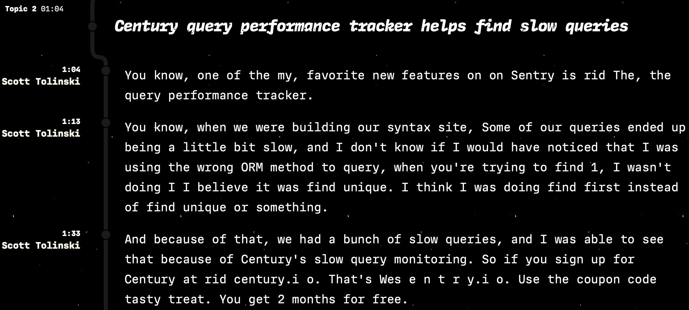

Hey, I had such a blast in our chats and got totally nerd-sniped by the thing you're creating.

I made this doc, mostly while walking to and from the (so please excuse its crudeness). But it's my pitch for the first quarter of working with a video creator.

## Summary

[Reinforce](#reinforce). [Connect](#connect). [Create](#create).

## Reinforce

Reinforce the addition of the podcasts with platform-specific capabilities: YouTube cards (dynamic but disruptive).

This helps distinguish video as a unique (higher fidelity) Syntax. experience.

We add short-form, vertical videos for max re-distrubution. And include a callout to the related episode: “Learn more about {X} at syntax.fm/{#}

These are a few candidates I pulled from the latest episode, that could use visual/educational reinforcement.

| Timestamp | Topic                                                                                                                                           | Like   |
| --------- | ----------------------------------------------------------------------------------------------------------------------------------------------- | ------ |
| 01:04     | [Drizzle][] is a modern ORM in TypeScript.                                                                                                      |        |
| 02:57     | Why do I need [Drizzle-Kit][]?                                                                                                                  | 💖     |
| 04:30     | How does Drizzle-Studio compare to other MyQSL web admins?                                                                                      | 💖     |
| 05:30     | Database viewer showdown: SQL Pro, TablePlus, PHPMyAdmin,<br /> mongodb compass, etc.                                                           | 💖     |
| 06:11     | What is [MD5 hashing](https://en.wikipedia.org/wiki/MD5)?                                                                                       |        |
| 06:50     | Eradicate slow queries with Drizzle Studio Benchmarks                                                                                           |        |
| 09:22     | Relationshal Databases compared: which is best for<br /> your project?                                                                          | 💖💖   |
| 09:49     | Create an [@rds] on [@service_provider] for free!<br />(Neon, Supabase, Vercel, Cloudflare, Upstash, Xata,<br /> Railway, Payload, PlanetScale) | 💖💖   |
| 13:44     | 5 major differences between MySQL and Postegres                                                                                                 | 💖💖💖 |
| 14:42     | Build a fullstack modern web app with these generous<br /> free teirs…                                                                          |        |
| 14:44     | Never create a new database — use Drizzle<br /> prefix instead!                                                                                 |        |
| 14:53     | This whole database is a single file!                                                                                                           |        |
| 18:17     | Which relational Database is right for you?                                                                                                     |        |
| 14:53     | SQLite — a file on your computer "you got yourself a<br /> database running"                                                                    | 💖💖💖 |

(Sorry, ran out of formatting time. See the [raw notes here](#raw-notes).)

[drizzle]: https://orm.drizzle.team
[drizzle-kit]: https://orm.drizzle.team/kit-docs/overview
[drizzle-studio]: https://orm.drizzle.team/drizzle-studio/overview
[drizzle-studio-benchmarks]: https://orm.drizzle.team/drizzle-studio/overview

## Connect

Connect the dots between video, social, and website.

Explore a cooperative workflow, where high-priority videos are identified (before video podcast release).

See if we can record and insert video right into the video podcast, [VH1 Pop-up video](https://en.wikipedia.org/wiki/Pop-Up_Video) style.
This is something that people loved in [Storybook's Storytime interview](https://www.youtube.com/watch?v=oxwDAMQGa0g&list=PLw6GJy26kmCIaRN1oVXNA8eBlWjP7N5Q_) series.

Unlike the cards approach, [above](#reinforce), this is completely non-disruptive to core content.

We could create some topical landing pages on the Syntax. website. `/orm`, `/react`, `/node`, etc. They could showcase all of the episodes with that as a topic. And eventually grow to include chnannel learning resources ([See: Create](#create)).

## Create

After I chat with Ben, I would recommend higher effort, more exhaustive, more durable, non-podcast formats for channel uploads. I think this would provide a broader counter-point to news-driven formats.

There are two formats that might do well here. This is the shape they could take for the latest episode (if the response justified additional content):

- `The Syntax Guide to SQL: The 20 commands, operators, and features you HAVE to know.`
  - Style: freecodecamp YouTube (guide)
  - Question: how?
- `A Brief History of ORMs: How they came to be and why they are still relevant.`
  - Documentary style.
  - Question: why?

"What", "when", and "where" are well covered by the podcast.

## Notes

Transcripting seems to prefer "Century" not "Sentry" 😅



# Raw notes

```
15:50 DBEngine (start and stop database servers)
17:20 — The messages and photos database are just SQLite. there was a video referenced here. find it
18:17 Why pick SQLite, Cloudflare D1, fly.io, bun
19:00 bun SQLite adapter built right in. Import with import assertions!
19:51 Get started with bun
20:00 bun import assertions
20:40 Database "schema"
21:20 Defining schemas with drizzle
22:00 What is a DSL?
23:00 Writing schemas in JavaScript
24:00 "You only need to use drizzle kit if you're using it to handle migrations and creations"
25:42 Let's open it up: spelunking open source: habitpath.io
27: how to JSON.Stringify wand the opposite one
27:20 Create a SQLite database
28:30 What is a relational database?
29:30 prisma linter (eslint plugin)?
30:00 Defining relations in drizzle
31:00 with: checks: true
32:00 answer overflow: https://www.answeroverflow.com (searching
33:00 chatgpt shootout: drizzle vs Prisma
33:43 "Ask AI button"
34:00 inkeep: https://inkeep.com
35:00 !! introspection / pull https://orm.drizzle.team/kit-docs/commands#introspect--pull
36:40 typescript completions
38:00 Run a drizzle migration (drizzle-kit generate) (show the value of version control, maybe use two machines)
41:00 query vs select (orm vs 'raw')
43:00 views (aggregations)
46:00 transactions
```
