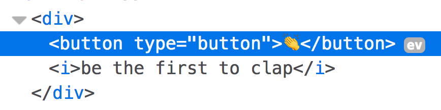

<div class="measure">

Look at HTML.
It lets you handle DOM events inline.

```html
<button
  onmouseenter="alert('imma...')"
  onmouseleave="alert('just passing through.')"
  onclick="alert('do that thing you do!')"
>Do something</button>
```
<br />

I could tell the sordid history that landed this in the "bad practice" bucket but we'd both be bored.

Suffice to say, folks bent on "good practices" had to jump through hoops to implement safe, reusable, cross-browser event handlers.

React Events don't share these trade-offs.


## Adding event handlers in React

Let's add an `onClick` (remember to camelCase) to our `ClapsCounter` from [yesterday](/2017/5).

```jsx
<button
  type="button"
  onClick={() => alert(1 + " claps!")}
/>
  👏
</button>
```

### Look, Ma! No strings!
First, you'll notice that we're not using strings anymore 🙌 🙌 🙌

This is a theme in React: 
**fewer strings, more JavaScript.**

### Look, Ma! No DOM handlers!
What the fish?
Where did our event handler go?



React did the work of making this "bad practice" a "good practice" by adding our event handler at the top of the `document`.

This is another React theme:
**best practices don't have to be complicated practices.**

### But really, what happened?
Magic 🔮👻

If you **must** know, you can read more about React's [Event handling magic](https://reactjs.org/docs/handling-events.html) and [Synthetic Events](https://reactjs.org/docs/events.html).

## Tinker with it

Use the workspace below and play with events.

* Add a few mouse events.
* For kicks, add a text input. Anything weird happen? Like you can't type in it? Spooooooky.

</div>

<iframe src="https://codesandbox.io/embed/62jmm57zmn" style="width:100%; height:500px; border:0; border-radius: 4px; overflow:hidden;" sandbox="allow-modals allow-forms allow-popups allow-scripts allow-same-origin"></iframe>
